# 🕹️ V Arcade SDL Games Suite

A massive collection of **86 playable 2D and 3D arcade games, retro classics, puzzle adventures, board games, and physics simulations** built in [V](https://vlang.io/) using [vlang/sdl](https://github.com/vlang/sdl). 

Every single game is engineered with **zero external asset dependencies** — utilizing 100% procedural PCM sound synthesis, vector graphics rasterization, and embedded pixel/bitmap fonts.

---

## ⚡ Requirements & Setup

Before running any game, ensure you have [V](https://vlang.io/) installed along with the official **V SDL wrapper**:

```bash
# Install V SDL module
v install sdl
```

> **System Dependencies**: `vlang/sdl` requires SDL2 development libraries on your machine:
> - **macOS**: `brew install sdl2 sdl2_gfx`
> - **Linux (Ubuntu/Debian)**: `sudo apt install libsdl2-dev libsdl2-gfx-dev`
---

## 🎮 Master Game Index (86 Games)

| # | Game | Folder | Genre | Quick Controls | How to Play |
| :-: | :--- | :--- | :--- | :--- | :--- | :-: |
| **1** | [Air Hockey](#1-hyper-air-hockey-airhockey) | `airhockey/` | Sports / Physics | `Mouse` / `WASD` (P1), `Arrows` / `IJKL` (P2) | [Guide](#1-hyper-air-hockey-airhockey) |
| **2** | [Asteroids Pro](#2-asteroids-pro-asteroids) | `asteroids/` | Vector Space Shooter | `A`/`D` rotate, `W` thrust, `Space` fire, `H` hyper | [Guide](#2-asteroids-pro-asteroids) |
| **3** | [Balloon Fight](#3-nes-balloon-fight-balloonfight) | `balloonfight/` | 1984 Flight Arcade | `WASD`/`Arrows` steer, `W`/`Space` flap, `P` pause | [Guide](#3-nes-balloon-fight-balloonfight) |
| **4** | [Battleship Pro](#4-battleship-pro-battleship) | `battleship/` | Naval Strategy | `Left Click` target/place, `Right Click`/`R` rotate | [Guide](#4-battleship-pro-battleship) |
| **5** | [Bejeweled Match-3](#5-bejeweled-match-3-bejeweled) | `bejeweled/` | Match-3 Cascade | `Mouse Drag` / `Click` swap gems, `H` hint | [Guide](#5-bejeweled-match-3-bejeweled) |
| **6** | [Bomberman Arcade](#6-bomberman-arcade-bomberman) | `bomberman/` | Action Maze Puzzle | `WASD`/`Arrows` move, `Space` plant bomb | [Guide](#6-bomberman-arcade-bomberman) |
| **7** | [Boulder Dash Retro](#7-boulder-dash-retro-boulderdash) | `boulderdash/` | Digging / Physics | `WASD`/`Arrows` dig, `P`/`N` cave select | [Guide](#7-boulder-dash-retro-boulderdash) |
| **8** | [Breakout Overdrive](#8-breakout-overdrive-breakout) | `breakout/` | Brick Breaker | `Mouse` / `A`/`D` paddle, `Space`/`Click` launch | [Guide](#8-breakout-overdrive-breakout) |
| **9** | [Bubble Shooter Pro](#9-bubble-shooter-pro-bubbleshooter) | `bubbleshooter/` | Match-3 Arcade | `Mouse Aim`, `Left Click`/`Space` fire bubble | [Guide](#9-bubble-shooter-pro-bubbleshooter) |
| **10** | [Centipede Pro](#10-cyber-centipede-pro-centipede) | `centipede/` | Fixed Shooter | `WASD`/`Arrows` move, `Space` rapid fire | [Guide](#10-cyber-centipede-pro-centipede) |
| **11** | [Chimp Test Pro](#11-chimp-test-pro-chimptest) | `chimptest/` | Cognitive Memory | `Left Click` numbers in ascending order | [Guide](#11-chimp-test-pro-chimptest) |
| **12** | [Chip's Challenge Deluxe](#12-chips-challenge-deluxe-chipschallenge) | `chipschallenge/` | Tile Puzzle Adventure | `WASD`/`Arrows` step/push, `R` restart | [Guide](#12-chips-challenge-deluxe-chipschallenge) |
| **13** | [Click Arcade](#13-click-arcade-4-in-1-clickarcade) | `clickarcade/` | 4-in-1 Casual Suite | `Left Click` / `Mouse Drag` all mini-games | [Guide](#13-click-arcade-4-in-1-clickarcade) |
| **14** | [Connect 4](#14-connect-4-connect4) | `connect4/` | Board Strategy / AI | `Left`/`Right` / `Click` column, `U` undo | [Guide](#14-connect-4-connect4) |
| **15** | [Cyber Vector Run 3D](#15-neon-vector-run-3d-cyberrunner) | `cyberrunner/` | 3D Highway Runner | `A`/`D` steer, `Space`/`W` jump, `Shift`/`S` boost | [Guide](#15-neon-vector-run-3d-cyberrunner) |
| **16** | [Dig Dug Classic](#16-dig-dug-classic-digdug) | `digdug/` | Underground Action | `WASD`/`Arrows` dig, `Space` pump harpoon | [Guide](#16-dig-dug-classic-digdug) |
| **17** | [Donkey Kong Arcade](#17-donkey-kong-arcade-donkeykong) | `donkeykong/` | Platformer Classic | `A`/`D` run, `W`/`S` climb ladders, `Space` jump | [Guide](#17-donkey-kong-arcade-donkeykong) |
| **18** | [Dope Wars 1990](#18-dope-wars-1990-dopewars) | `dopewars/` | Turn-Based Economy | `1-8` commodities, `B` buy, `S` sell, `T` subway | [Guide](#18-dope-wars-1990-dopewars) |
| **19** | [Duke Nukem: Cyber Outpost](#19-duke-nukem-cyber-outpost-duke) | `duke/` | Side-Scroll Platformer | `A`/`D` move, `W` climb/aim, `Space` jump, `Ctrl` fire | [Guide](#19-duke-nukem-cyber-outpost-duke) |
| **20** | [Etch A Sketch Deluxe](#20-etch-a-sketch-deluxe-etchasketch) | `etchasketch/` | Creative Drawing | `WASD`/`Arrows`/`Drag` draw, `Space` shake | [Guide](#20-etch-a-sketch-deluxe-etchasketch) |
| **21** | [Flappy Bird Pro](#21-flappy-bird-pro-flappy) | `flappy/` | Physics Tap Arcade | `Space` / `Up` / `Click` flap wings | [Guide](#21-flappy-bird-pro-flappy) |
| **22** | [Frogger Arcade](#22-frogger-arcade-frogger) | `frogger/` | Road & River Crossing | `WASD` / `Arrows` hop 4-way, `R` reset | [Guide](#22-frogger-arcade-frogger) |
| **23** | [Galaga Space Shooter](#23-galaga-space-shooter-galaga) | `galaga/` | Fixed Wave Shooter | `A`/`D`/`Arrows` slide ship, `Space` fire | [Guide](#23-galaga-space-shooter-galaga) |
| **24** | [2048 Neon Pulse](#24-2048-neon-pulse-game2048) | `game2048/` | Sliding Merge Puzzle | `WASD` / `Arrows` / `Drag` slide tiles | [Guide](#24-2048-neon-pulse-game2048) |
| **25** | [GNUjump Tower](#25-gnujump-tower-gnujump) | `gnujump/` | Vertical Tower Jumper | `A`/`D`/`Arrows` steer, `Space` high jump | [Guide](#25-gnujump-tower-gnujump) |
| **26** | [Gold Miner Classic](#26-gold-miner-classic-goldminer) | `goldminer/` | Winch & Reel Arcade | `Down`/`Space`/`Click` reel claw, `Up` dynamite | [Guide](#26-gold-miner-classic-goldminer) |
| **27** | [JezzBall Pro](#27-jezzball-pro-jezzball) | `jezzball/` | Kinetic Containment | `Left Click` build wall, `Right Click` rotate axis | [Guide](#27-jezzball-pro-jezzball) |
| **28** | [Lemmings Master](#28-lemmings-master-lemmings) | `lemmings/` | Colony Puzzle Strategy | `Mouse Click` assign skills, `F` fast forward | [Guide](#28-lemmings-master-lemmings) |
| **29** | [Liar's Dice Deluxe](#29-liars-dice-deluxe-liarsdice) | `liarsdice/` | Bluffing Dice Party | `Space` bid, `L` call Liar!, `C` Spot On! | [Guide](#29-liars-dice-deluxe-liarsdice) |
| **30** | [Tron Light Cycles](#30-tron-light-cycles-lightcycles) | `lightcycles/` | Grid Arena Racing | `WASD` P1 move + `Space` boost, `IJKL` P2 | [Guide](#30-tron-light-cycles-lightcycles) |
| **31** | [Adventures of Lolo](#31-adventures-of-lolo-lolo) | `lolo/` | Top-Down Grid Puzzle | `WASD`/`Arrows` move/push, `Space` magic shot | [Guide](#31-adventures-of-lolo-lolo) |
| **32** | [Lunar Lander Simulator](#32-lunar-lander-simulator-lunarlander) | `lunarlander/` | Vector Moon Landing | `A`/`D` rotate, `W`/`Up`/`Space` thruster | [Guide](#32-lunar-lander-simulator-lunarlander) |
| **33** | [Mappy Arcade](#33-mappy-arcade-mappy) | `mappy/` | Police Trampoline Run | `A`/`D` move/dismount, `Space`/`W` open doors | [Guide](#33-mappy-arcade-mappy) |
| **34** | [Memory Match Pro](#34-memory-match-pro-memorymatch) | `memorymatch/` | Card Flipping Pairs | `Left Click` flip cards, `G` grid size (4x4 to 6x6) | [Guide](#34-memory-match-pro-memorymatch) |
| **35** | [Micro Mayhem](#35-micro-mayhem-micromayhem) | `micromayhem/` | 4-Second Micro Marathon | `Space` / `1-3` / `WASD` / `Mouse` per game | [Guide](#35-micro-mayhem-micromayhem) |
| **36** | [Minesweeper Pro](#36-minesweeper-pro-minesweeper) | `minesweeper/` | Minefield Logic | `Left Click` reveal/chord, `Right Click` flag | [Guide](#36-minesweeper-pro-minesweeper) |
| **37** | [Missile Command](#37-missile-command-air-defense-missilecommand) | `missilecommand/` | Anti-Ballistic Defense | `Mouse Aim` + `Left Click` fire counter-missile | [Guide](#37-missile-command-air-defense-missilecommand) |
| **38** | [Pac-Man Arcade](#38-pac-man-arcade-pacman) | `pacman/` | Maze Dot-Chomp | `WASD` / `Arrows` steer Pac-Man | [Guide](#38-pac-man-arcade-pacman) |
| **39** | [Peggle Extreme](#39-peggle-extreme-peggle) | `peggle/` | Pachinko Ballistics | `Mouse Aim` / `Left Click` or `Space` launch ball | [Guide](#39-peggle-extreme-peggle) |
| **40** | [Picross Pro](#40-picross-pro-picross) | `picross/` | Nonogram Logic Grid | `Left Click` fill, `Right Click` cross, `H` hint | [Guide](#40-picross-pro-picross) |
| **41** | [NES Pinball](#41-nes-pinball-pinball) | `pinball/` | 1984 Pinball Simulation | `Z`/`X` flippers, `Space` plunger, `T` tilt | [Guide](#41-nes-pinball-pinball) |
| **42** | [Hyper Pong](#42-hyper-pong-pong) | `pong/` | 2D Paddle Rally | `W`/`S` (P1 paddle), `Up`/`Down` (P2 paddle) | [Guide](#42-hyper-pong-pong) |
| **43** | [Puyo Puyo Cascade](#43-puyo-puyo-cascade-puyopuyo) | `puyopuyo/` | Match-4 Jelly Drop | `A`/`D` move, `W`/`Z` rotate CW, `Space` drop | [Guide](#43-puyo-puyo-cascade-puyopuyo) |
| **44** | [Q*bert Isometric](#44-qbert-isometric-qbert) | `qbert/` | 2.5D Pyramid Hop | `Q/E/A/D` / `Numpad 7/9/1/3` / `Arrows` hop | [Guide](#44-qbert-isometric-qbert) |
| **45** | [Cyber Drift Racer](#45-cyber-drift-racer-racer) | `racer/` | Top-Down Drift Racing | `W`/`S` gas/brake, `A`/`D` steer, `Space` drift | [Guide](#45-cyber-drift-racer-racer) |
| **46** | [Ragdoll Physics](#46-ragdoll-physics-sandbox-ragdoll) | `ragdoll/` | Verlet Physics Lab | `Mouse Drag` joints, `Q-I` tools, `G` gravity | [Guide](#46-ragdoll-physics-sandbox-ragdoll) |
| **47** | [Monsoon Overdrive](#47-monsoon-overdrive-rain-benchmark-rain) | `rain/` | Fluid Rain & Benchmark | `Mouse` umbrella, `1-5` presets, `[`/`]` stress | [Guide](#47-monsoon-overdrive-rain-benchmark-rain) |
| **48** | [Reversi Master](#48-reversi-master-reversi) | `reversi/` | 8x8 Board Reversi | `Left Click` place disc, `U` undo, `H` hint | [Guide](#48-reversi-master-reversi) |
| **49** | [Rodent's Revenge](#49-rodents-revenge-rodentsrevenge) | `rodentsrevenge/` | Cat Trapping Puzzle | `WASD`/`Arrows` push crates & trap cats | [Guide](#49-rodents-revenge-rodentsrevenge) |
| **50** | [Scorched Earth](#50-scorched-earth-deluxe-scorchedearth) | `scorchedearth/` | Tank Artillery War | `A`/`D` angle, `W`/`S` power, `1-6` weapons | [Guide](#50-scorched-earth-deluxe-scorchedearth) |
| **51** | [Cyber Shinobi](#51-cyber-shinobi-runner-shinobi) | `shinobi/` | Ninja Action Platformer | `A`/`D` run, `W` jump, `J` katana, `K` shuriken | [Guide](#51-cyber-shinobi-runner-shinobi) |
| **52** | [Cyberpunk Vanguard](#52-cyberpunk-vanguard-sidescroller) | `sidescroller/` | 2D Action Side-Scroller | `WASD` move, `W`/`Space` jetpack, `J` fire, `K` dash | [Guide](#52-cyberpunk-vanguard-sidescroller) |
| **53** | [Cyber Simon](#53-cyber-simon-simon) | `simon/` | Audio-Visual Sequence | `Click` / `1-4` / `Q-S` pads, `M` mode | [Guide](#53-cyber-simon-simon) |
| **54** | [SinkSub Pro](#54-sinksub-pro-sinksub) | `sinksub/` | Submarine Hunter | `Left`/`Right` steer ship, `Z` depth charge, `X` rocket | [Guide](#54-sinksub-pro-sinksub) |
| **55** | [SkiFree Extreme](#55-skifree-extreme-skifree) | `skifree/` | Downhill Slalom Stunts | `Arrows`/`WASD` steer & tricks, `Space` jump | [Guide](#55-skifree-extreme-skifree) |
| **56** | [Cyberpunk Snake](#56-cyberpunk-snake-snake) | `snake/` | Neon Snake Slither | `WASD` / `Arrows` steer snake, `P` pause | [Guide](#56-cyberpunk-snake-snake) |
| **57** | [Sokoban Master](#57-sokoban-master-sokoban) | `sokoban/` | Warehouse Box Pushing | `WASD`/`Arrows` move, `U` undo, `N`/`P` level | [Guide](#57-sokoban-master-sokoban) |
| **58** | [Space Invaders Pro](#58-space-invaders-pro-spaceinvaders) | `spaceinvaders/` | 1978 Space Defense | `A`/`D` steer cannon, `Space` fire laser | [Guide](#58-space-invaders-pro-spaceinvaders) |
| **59** | [Modern Tetris](#59-modern-tetris-tetris) | `tetris/` | SRS Matrix Puzzle | `Left`/`Right` move, `Up` rotate, `Space` hard drop, `C` hold | [Guide](#59-modern-tetris-tetris) |
## 🎮 Master Game Index (85 Games)

| # | Game | Folder | Genre / Style | Key Controls | Guide |
|---|---|---|---|---|---|
| **1** | [Hyper Air Hockey](#1-hyper-air-hockey-airhockey) | `airhockey/` | 2D Physics Table Sports | `Mouse Aim`/`Drag`, `P` pause, `R` reset | [Guide](#1-hyper-air-hockey-airhockey) |
| **2** | [Vector Asteroids](#2-vector-asteroids-asteroids) | `asteroids/` | 1979 Vector Space Shooter | `A`/`D` rotate, `W` thrust, `Space` shoot, `S` hyperspace | [Guide](#2-vector-asteroids-asteroids) |
| **3** | [Balloon Fight](#3-balloon-fight-balloonfight) | `balloonfight/` | 1984 8-Bit Platformer | `A`/`D` move, `Space`/`W` flap, `S` dive | [Guide](#3-balloon-fight-balloonfight) |
| **4** | [Naval Battleship](#4-naval-battleship-battleship) | `battleship/` | Turn-Based Grid Strategy | `Mouse Click` fire/place, `R` rotate, `A` AI duel | [Guide](#4-naval-battleship-battleship) |
| **5** | [Bejeweled Deluxe](#5-bejeweled-match-3-bejeweled) | `bejeweled/` | Cascading Match-3 Gems | `Click`/`WASD`/`Space` swap, `U` undo, `T` music, `M` mode | [Guide](#5-bejeweled-match-3-bejeweled) |
| **6** | [Atomic Bomberman](#6-atomic-bomberman-bomberman) | `bomberman/` | 4-Player Maze Arena | `WASD` move, `Space` bomb, `E` remote | [Guide](#6-atomic-bomberman-bomberman) |
| **7** | [Boulder Dash](#7-boulder-dash-boulderdash) | `boulderdash/` | 1984 Cave Digger Puzzle | `WASD`/`Arrows` dig/move, `Space` grab | [Guide](#7-boulder-dash-boulderdash) |
| **8** | [10-Pin Bowling](#8-10-pin-bowling-bowling) | `bowling/` | 3D Perspective Sports | `A`/`D` position, `Space` meter (aim & spin) | [Guide](#8-10-pin-bowling-bowling) |
| **9** | [Neon Breakout](#9-neon-breakout-breakout) | `breakout/` | Arcade Brick Breaker | `Mouse`/`A`/`D` paddle, `Space` launch/laser | [Guide](#9-neon-breakout-breakout) |
| **10** | [Bubble Shooter](#10-bubble-shooter-bubbleshooter) | `bubbleshooter/` | Match-3 Bubble Physics | `Mouse Aim`, `Left Click`/`Space` launch | [Guide](#10-bubble-shooter-bubbleshooter) |
| **11** | [Centipede Arcade](#11-centipede-arcade-centipede) | `centipede/` | 1980 Trackball Shooter | `WASD`/`Arrows` move, `Space` rapid fire | [Guide](#11-centipede-arcade-centipede) |
| **12** | [Chimp Memory Test](#12-chimp-memory-test-chimptest) | `chimptest/` | Cognitive Benchmark | `Mouse Click` ascending number sequence | [Guide](#12-chimp-memory-test-chimptest) |
| **13** | [Chip's Challenge](#13-chips-challenge-chipschallenge) | `chipschallenge/` | 1989 Tile Puzzle Classic | `WASD`/`Arrows` walk, `R` restart level | [Guide](#13-chips-challenge-chipschallenge) |
| **14** | [Clicker Arcade Empire](#14-clicker-arcade-empire-clickarcade) | `clickarcade/` | Incremental Idle Tycoon | `Mouse Click` earn tokens, buy arcade cabs | [Guide](#14-clicker-arcade-empire-clickarcade) |
| **15** | [Connect Four 3D](#15-connect-four-3d-connect4) | `connect4/` | Vertical 4-in-a-Row Strategy | `1-7`/`Click` drop disc, `U` undo, `A` AI vs | [Guide](#15-connect-four-3d-connect4) |
| **16** | [Cyber Runner 2088](#16-cyber-runner-2088-cyberrunner) | `cyberrunner/` | Cyberpunk Endless Runner | `A`/`D` strafe, `Space` jump, `S` slide | [Guide](#16-cyber-runner-2088-cyberrunner) |
| **17** | [Pub Darts 501 / Cricket](#17-pub-darts-501--cricket-darts) | `darts/` | Realistic Dartboard Sports | `Mouse Aim`, `Hold Left Click` draw, `Release` throw | [Guide](#17-pub-darts-501--cricket-darts) |
| **18** | [Dig Dug Classic](#18-dig-dug-classic-digdug) | `digdug/` | 1982 Underground Harpooner | `WASD` dig, `Space` pump harpoon, `F` rock drop | [Guide](#18-dig-dug-classic-digdug) |
| **19** | [Donkey Kong Arcade](#19-donkey-kong-arcade-donkeykong) | `donkeykong/` | 1981 Girder Climbing Platformer | `A`/`D` run, `Space` jump, `W`/`S` climb ladders | [Guide](#19-donkey-kong-arcade-donkeykong) |
| **20** | [Dope Wars: NYC Underworld](#20-dope-wars-nyc-underworld-dopewars) | `dopewars/` | Turn-Based Commodity Trading | `1-8` buy/sell, `T` travel subway, `B` bank, `L` loan shark | [Guide](#20-dope-wars-nyc-underworld-dopewars) |
| **21** | [Duke Nukem 1991](#21-duke-nukem-1991-duke) | `duke/` | Apogee 2D Action Platformer | `A`/`D` move, `W`/`S` aim/look, `Space` jump, `J`/`Ctrl` fire | [Guide](#21-duke-nukem-1991-duke) |
| **22** | [Etch-a-Sketch Studio](#22-etch-a-sketch-studio-etchasketch) | `etchasketch/` | Mechanical Dual-Knob Drawing | `WASD`/`Arrows` dual knobs, `Space` shake clear | [Guide](#22-etch-a-sketch-studio-etchasketch) |
| **23** | [Flappy Wings 3D](#23-flappy-wings-3d-flappy) | `flappy/` | Precision Obstacle Tapper | `Space`/`Click` flap wings, `P` pause | [Guide](#23-flappy-wings-3d-flappy) |
| **24** | [Frogger Arcade](#24-frogger-arcade-frogger) | `frogger/` | 1981 Konami Traffic & River | `WASD`/`Arrows` leap frog forward/side | [Guide](#24-frogger-arcade-frogger) |
| **25** | [Galaga: Tactical Fighter](#25-galaga-tactical-fighter-galaga) | `galaga/` | 1981 Fixed Space Shooter | `A`/`D` strafe, `Space` dual photon torpedoes | [Guide](#25-galaga-tactical-fighter-galaga) |
| **26** | [2048 Hex & Classic](#26-2048-hex--classic-game2048) | `game2048/` | Sliding Tile Math Puzzle | `WASD`/`Arrows` slide tiles, `H` hex mode toggle | [Guide](#26-2048-hex--classic-game2048) |
| **27** | [GNU Jump (Xjump Deluxe)](#27-gnu-jump-xjump-deluxe-gnujump) | `gnujump/` | Vertical Tower Tower Platformer | `A`/`D` run, `Space` high spring jump | [Guide](#27-gnu-jump-xjump-deluxe-gnujump) |
| **28** | [Gold Miner Classic](#28-gold-miner-classic-goldminer) | `goldminer/` | Winches & Dynamite Digger | `S`/`Down` launch claw, `W`/`Up` toss dynamite | [Guide](#28-gold-miner-classic-goldminer) |
| **29** | [JezzBall Studio](#29-jezzball-studio-jezzball) | `jezzball/` | 1992 Windows Containment | `Left Click` build wall, `Right Click`/`Space` flip axis | [Guide](#29-jezzball-studio-jezzball) |
| **30** | [Lemmings: Tribe Command](#30-lemmings-tribe-command-lemmings) | `lemmings/` | 1991 Lemming Tribe Strategy | `1-8` select skill, `Left Click` assign, `P` pause | [Guide](#30-lemmings-tribe-command-lemmings) |
| **31** | [Liar's Dice (Perudo)](#31-liars-dice-perudo-liarsdice) | `liarsdice/` | Bluffing Dice Tournament | `1-6` quantity/face bid, `C` challenge/call liar | [Guide](#31-liars-dice-perudo-liarsdice) |
| **32** | [TRON Light Cycles 3D](#32-tron-light-cycles-3d-lightcycles) | `lightcycles/` | Grid Trail Survival Combat | `WASD` (P1), `Arrows` (P2), `Space` turbo boost | [Guide](#32-tron-light-cycles-3d-lightcycles) |
| **33** | [Adventures of Lolo](#33-adventures-of-lolo-lolo) | `lolo/` | HAL Laboratory Block Puzzler | `WASD` walk, `Space` magic shot, `R` restart room | [Guide](#33-adventures-of-lolo-lolo) |
| **34** | [Lunar Lander Simulator](#34-lunar-lander-simulator-lunarlander) | `lunarlander/` | Vector Gravity Physics Lander | `A`/`D` tilt thrusters, `W`/`Space` main throttle | [Guide](#34-lunar-lander-simulator-lunarlander) |
| **35** | [Mappy: Micro Police](#35-mappy-micro-police-mappy) | `mappy/` | 1983 Namco Trampoline Chase | `A`/`D` run, `Space` open door/microwave blast | [Guide](#35-mappy-micro-police-mappy) |
| **36** | [Memory Tile Match 3D](#36-memory-tile-match-3d-memorymatch) | `memorymatch/` | Card Matching Memory Puzzle | `Mouse Click` flip card pair, `T` theme change | [Guide](#36-memory-tile-match-3d-memorymatch) |
| **37** | [Micro Mayhem: RC Racers](#37-micro-mayhem-rc-racers-micromayhem) | `micromayhem/` | Tabletop RC Isometric Racing | `W`/`S` accelerate/brake, `A`/`D` steer, `Space` nitro | [Guide](#37-micro-mayhem-rc-racers-micromayhem) |
| **38** | [Minesweeper Classic](#38-minesweeper-classic-minesweeper) | `minesweeper/` | Windows Grid Logic Sweeper | `Left Click` reveal, `Right Click` flag, `1-3` difficulty | [Guide](#38-minesweeper-classic-minesweeper) |
| **39** | [Missile Command Defender](#39-missile-command-defender-missilecommand) | `missilecommand/` | 1980 ICBM Ballistic Defense | `Mouse Aim`, `1`/`2`/`3` or `Left Click` fire battery | [Guide](#39-missile-command-defender-missilecommand) |
| **40** | [Pac-Man Championship](#40-pac-man-championship-pacman) | `pacman/` | 1980 Maze Dot Muncher | `WASD`/`Arrows` steer, `P` pause | [Guide](#40-pac-man-championship-pacman) |
| **41** | [Peggle: Extreme Pachinko](#41-peggle-extreme-pachinko-peggle) | `peggle/` | Peg-Popping Physics Ball | `Mouse Aim`, `Left Click` launch ball | [Guide](#41-peggle-extreme-pachinko-peggle) |
| **42** | [Picross Nonogram Studio](#42-picross-nonogram-studio-picross) | `picross/` | Picture Logic Number Cross | `Left Click` chisel, `Right Click` cross-out | [Guide](#42-picross-nonogram-studio-picross) |
| **43** | [Space Cadet Pinball](#43-space-cadet-pinball-pinball) | `pinball/` | Windows 3D Table Simulation | `Z`/`Slash` flippers, `Space` pull plunger | [Guide](#43-space-cadet-pinball-pinball) |
| **44** | [Pong 1972 Vector](#44-pong-1972-vector-pong) | `pong/` | Atari First Video Game | `W`/`S` (P1), `Up`/`Down` (P2), `1`/`2` modes | [Guide](#44-pong-1972-vector-pong) |
| **45** | [8-Ball Pool Billiards](#45-8-ball-pool-billiards-pool) | `pool/` | Cue Stick Ball Physics | `Mouse Aim`, `Hold Drag` cue power, `Release` stroke | [Guide](#45-8-ball-pool-billiards-pool) |
| **46** | [Puyo Puyo Tsu](#46-puyo-puyo-tsu-puyopuyo) | `puyopuyo/` | Sega Competitive Match-4 | `A`/`D` move, `W` rotate, `S` soft drop, `Space` hard drop | [Guide](#46-puyo-puyo-tsu-puyopuyo) |
| **47** | [Q*bert Isometric](#47-qbert-isometric-qbert) | `qbert/` | 1982 Pyramid Tile Hopper | `Q`/`E`/`Z`/`C` or `WASD` hop diagonal steps | [Guide](#47-qbert-isometric-qbert) |
| **48** | [OutRun Retro Racer](#48-outrun-retro-racer-racer) | `racer/` | Pseudo-3D Highway Racer | `A`/`D` steer, `W` accelerate, `S` brake, `Space` turbo | [Guide](#48-outrun-retro-racer-racer) |
| **49** | [Ragdoll Physics Playground](#49-ragdoll-physics-playground-ragdoll) | `ragdoll/` | Interactive Particle Sandbox | `Mouse Drag` toss ragdoll, `Space` blast shockwave | [Guide](#49-ragdoll-physics-playground-ragdoll) |
| **50** | [Matrix Digital Rain](#50-matrix-digital-rain-rain) | `rain/` | Cyberpunk Phosphor Visualizer | `1-5` color palette, `Space` freeze code streams | [Guide](#50-matrix-digital-rain-rain) |
| **51** | [Othello / Reversi](#51-othello--reversi-reversi) | `reversi/` | Flanking Flips Strategy | `Mouse Click` place disc, `U` undo, `A` AI vs | [Guide](#51-othello--reversi-reversi) |
| **52** | [Rodent's Revenge](#52-rodents-revenge-rodentsrevenge) | `rodentsrevenge/` | 1991 Windows Mouse & Cats | `WASD`/`Arrows` push blocks to trap cats into cheese | [Guide](#52-rodents-revenge-rodentsrevenge) |
| **53** | [Scorched Earth Artillery](#53-scorched-earth-artillery-scorchedearth) | `scorchedearth/` | Destructible Voxel Artillery | `A`/`D` aim angle, `W`/`S` power, `Space` launch missile | [Guide](#53-scorched-earth-artillery-scorchedearth) |
| **54** | [Shinobi Ninja Shadow](#54-shinobi-ninja-shadow-shinobi) | `shinobi/` | 1987 Sega Ninja Action | `A`/`D` run, `Space` jump, `J` shuriken, `K` katana slash | [Guide](#54-shinobi-ninja-shadow-shinobi) |
| **55** | [Moon Patrol Side-Scroller](#55-moon-patrol-side-scroller-sidescroller) | `sidescroller/` | 1982 Moon Rover Buggy | `A`/`D` accelerate/brake, `Space` vertical jump, `J` cannons | [Guide](#55-moon-patrol-side-scroller-sidescroller) |
| **56** | [Simon Memory Electronic](#56-simon-memory-electronic-simon) | `simon/` | 1978 Milton Bradley Audio | `1-4`/`Click` quadrant buttons, `R` restart | [Guide](#56-simon-memory-electronic-simon) |
| **57** | [Sink the Submarine (Sub Chase)](#57-sink-the-submarine-sub-chase-sinksub) | `sinksub/` | 1982 Destroyer Depth Charges | `A`/`D` steer destroyer, `J`/`K` drop port/starboard depth charges | [Guide](#57-sink-the-submarine-sub-chase-sinksub) |
| **58** | [SkiFree 1991 Windows](#58-skifree-1991-windows-skifree) | `skifree/` | Windows Slalom & Yeti Chase | `A`/`D` steer skis, `S` tuck speed, `Space` jump moguls | [Guide](#58-skifree-1991-windows-skifree) |
| **59** | [Viper Snake Classic](#59-viper-snake-classic-snake) | `snake/` | Nokia Nibbles Snake | `WASD`/`Arrows` steer snake, `P` pause | [Guide](#59-viper-snake-classic-snake) |
| **60** | [Sokoban Warehouse Master](#60-sokoban-warehouse-master-sokoban) | `sokoban/` | 1982 Warehouse Crate Puzzler | `WASD`/`Arrows` push crates, `U` undo, `R` restart room | [Guide](#60-sokoban-warehouse-master-sokoban) |
| **61** | [Space Invaders 1978](#61-space-invaders-1978-spaceinvaders) | `spaceinvaders/` | Taito Fixed Wave Shooter | `A`/`D` move bunker base, `Space` laser cannon | [Guide](#61-space-invaders-1978-spaceinvaders) |
| **62** | [Tamagotchi Virtual Pet](#62-tamagotchi-virtual-pet-tamagotchi) | `tamagotchi/` | 1996 Bandai Digital Companion | `A`/`B`/`C` device buttons to feed, play, clean, and cure | [Guide](#62-tamagotchi-virtual-pet-tamagotchi) |
| **63** | [Tetris Soviet Master](#63-tetris-soviet-master-tetris) | `tetris/` | 1984 Falling Tetromino Legend | `A`/`D` move, `W`/`Up` rotate, `S` soft drop, `Space` hard drop | [Guide](#63-tetris-soviet-master-tetris) |
| **64** | [Kingdom Tower Defense](#64-kingdom-tower-defense-towerdefense) | `towerdefense/` | Strategic Turret Defense | `1-4` select turret type, `Click` place on grid | [Guide](#64-kingdom-tower-defense-towerdefense) |
| **65** | [Trivia Quest Master](#65-trivia-quest-master-trivia) | `trivia/` | Quiz Arcade Showdown | `1-4`/`Click` answer options, `50/50` lifeline | [Guide](#65-trivia-quest-master-trivia) |
| **66** | [Nitro Typist Speed Test](#66-nitro-typist-speed-test-typing) | `typing/` | Arcade Typing Benchmark | `Type Keys` match stream words, `Backspace` correct | [Guide](#66-nitro-typist-speed-test-typing) |
| **67** | [Vegas Jackpot Slots](#67-vegas-jackpot-slots-slots) | `slots/` | Casino / 777 Slots | `Space`/`Click` spin lever, `1-3` hold, `T` theme | [Guide](#67-vegas-jackpot-slots-slots) |
| **68** | [Uno Master](#68-uno-master-uno) | `uno/` | Classic Color Match Card | `A`/`D` select card, `Space` play, `X` draw, `U` Uno! | [Guide](#68-uno-master-uno) |
| **69** | [War Card Battle](#69-war-card-battle-war) | `war/` | 52-Card War Showdown | `Space`/`Click` flip duel, `A` auto-play, `R` restart | [Guide](#69-war-card-battle-war) |
| **70** | [Blackjack 21 Pro](#70-blackjack-21-pro-blackjack) | `blackjack/` | Vegas Blackjack 21 | `Space` deal, `H` hit, `S` stand, `D` double, `P` split | [Guide](#70-blackjack-21-pro-blackjack) |
| **71** | [Texas Hold'em Poker](#71-texas-holdem-poker-texas) | `texas/` | No-Limit Texas Hold'em | `C` check/call, `R` raise, `F` fold, `A` all-in | [Guide](#71-texas-holdem-poker-texas) |
| **72** | [TI-83 Block Dude](#72-ti-83-block-dude-blockdude) | `blockdude/` | Calculator Puzzle Platformer | `A`/`D` move, `Space`/`W`/`S` pick/drop, `U` undo | [Guide](#72-ti-83-block-dude-blockdude) |
| **73** | [Game & Watch: Fire](#73-nintendo-game--watch-fire-fire) | `fire/` | 1980 LCD Handheld | `Left`/`Right`/`A`/`D` move trampoline, `1`/`2` mode | [Guide](#73-nintendo-game--watch-fire-fire) |
| **74** | [Ultimate Screensaver Suite](#74-ultimate-retro-screensaver-suite-screensaver) | `screensaver/` | 102 Retro Screensavers | `Tab` Display Properties, `Right`/`Left` next/prev, `C` cycle | [Guide](#74-ultimate-retro-screensaver-suite-screensaver) |
| **75** | [Columns](#75-sega-columns-columns) | `columns/` | 1990 Gem Drop Match-3 | `A`/`D` move, `W`/`Up`/`Space` cycle, `S` soft drop, `Enter` hard drop | [Guide](#75-sega-columns-columns) |
| **76** | [Klax](#76-atari-klax-klax) | `klax/` | 1989 Conveyor Matcher | `A`/`D` steer paddle, `S`/`Space` flip tile, `W`/`Up` push up | [Guide](#76-atari-klax-klax) |
| **77** | [Super Puzzle Fighter II Turbo](#77-super-puzzle-fighter-ii-turbo-puzzlefighter) | `puzzlefighter/` | 1v1 Arcade Gem Battler | `A`/`D` move, `W` rotate, `S` drop, `Space` hard drop | [Guide](#77-super-puzzle-fighter-ii-turbo-puzzlefighter) |
| **78** | [Zuma](#78-zuma-temple-of-the-stone-idol-zuma) | `zuma/` | PopCap Track Shooter | `Mouse Aim`, `Left Click`/`Space` shoot, `Right Click`/`Tab` swap | [Guide](#78-zuma-temple-of-the-stone-idol-zuma) |
| **79** | [Panel de Pon / Puzzle League](#79-panel-de-pon-puzzle-league-paneldepon) | `paneldepon/` | Horizontal Swap Match-3 | `WASD`/`Arrows` move, `Space`/`J` swap, `LShift`/`K` raise | [Guide](#79-panel-de-pon-puzzle-league-paneldepon) |
| **80** | [SameGame / Collapse](#80-samegame--collapse-samegame) | `samegame/` | Gem Cluster Collapse | `Mouse Hover` select, `Left Click` shatter, `T` mode toggle | [Guide](#80-samegame--collapse-samegame) |
| **81** | [Mario Bros. Arcade](#81-mario-bros-arcade-mariobros) | `mariobros/` | Platformer Classic / 2P Co-op | `WASD`/`Space` (P1), `J`/`L`/`I` (P2), `P` pause | [Guide](#81-mario-bros-arcade-mariobros) |
| **82** | [The Legend of Kage](#82-the-legend-of-kage-legendofkage) | `legendofkage/` | 1985 Taito Ninja Acrobatic Classic | `A`/`D` move, `Space`/`W` super leap, `J` sword, `K` shuriken | [Guide](#82-the-legend-of-kage-legendofkage) |
| **83** | [Yie Ar Kung-Fu](#83-yie-ar-kung-fu-yiearkungfu) | `yiearkungfu/` | 1985 Konami 1v1 Fighting Legend | `WASD` move/jump, `J` punch, `K` kick, deflect weapons | [Guide](#83-yie-ar-kung-fu-yiearkungfu) |
| **84** | [Kung-Fu Master (Spartan X)](#84-kung-fu-master-spartan-x-kungfu) | `kungfu/` | 1984 Irem Beat 'Em Up Classic | `WASD` move/jump/crouch, `J` punch, `K` kick, wiggle escape | [Guide](#84-kung-fu-master-spartan-x-kungfu) |
| **85** | [Dr. Mario](#85-dr-mario-drmario) | `drmario/` | 1990 Falling Megavitamin Puzzle | `A`/`D` move, `S` soft drop, `Space` hard drop, `W`/`J` rotate CW, `K` CCW, `Shift` hold | [Guide](#85-dr-mario-drmario) |
| **86** | [Yoshi's Cookie](#86-yoshis-cookie-yoshicookie) | `yoshicookie/` | 1992 Line-Sliding Bakery Puzzle | `WASD`/`Arrows` move, `Hold Space/J/Z` + `Move` shift row/col | [Guide](#86-yoshis-cookie-yoshicookie) |

---

# 📖 Complete "How to Play" Guides

---

### 1. Hyper Air Hockey (`airhockey/`)
*High-Speed 2D Table Hockey with Elastic Collision Physics*

```bash
v run airhockey
```


- **Objective**: Use your mallet to strike the puck across the centerline and score into your opponent's goal. First to 7 goals wins the match!
- **Controls**:
  - **Player 1 (Left Mallet)**: `Mouse` cursor tracking or `WASD` keyboard navigation.
  - **Player 2 (Right Mallet)**: `Arrow Keys` or `IJKL`.
  - **Game Options**: `Tab` cycles AI difficulty (Easy, Medium, Pro), `M` toggles 1P vs AI / 2P Local mode, `R` resets match, `V` toggles audio.
- **Rules & Mechanics**:
  - Continuous circle-on-circle collision physics with mallet-to-puck momentum transfer, bank shots, and friction decay.
  - Mallets are physically constrained to their respective halves of the table.
  - Goal horn sounds and dynamic particle spark explosions celebrate every scored point.
- **Pro Tip**: Hit the puck while your mallet is actively accelerating forward to execute high-speed bank trick shots off the side rails!

---

### 2. Asteroids Pro (`asteroids/`)
*Vector Inertia Space Dogfight with Asteroid Splitting & Power-Ups*

```bash
v run asteroids
```


- **Objective**: Pilot your spacecraft in zero-gravity space, pulverize floating asteroid fields into smaller fragments, eliminate hostile alien UFOs, and survive infinite waves.
- **Controls**:
  - `A` / `D` or `Left` / `Right`: Rotate spacecraft.
  - `W` or `Up`: Fire main inertia thrusters.
  - `Space`: Fire photon laser cannons.
  - `H`: Engage emergency Hyperspace teleportation (random spatial coordinates).
  - `S`: Deploy plasma shield (absorbs 1 collision).
  - `R`: Restart game.
- **Rules & Mechanics**:
  - Asteroids split hierarchically: Large (20 pts) $\to$ 2 Medium (50 pts) $\to$ 2 Small (100 pts) $\to$ Destroyed.
  - Flying Saucers hunt the player and fire targeted laser bursts (200-1,000 pts).
  - Collect floating power-up orbs: **3x Spread Shot**, **Overcharged Shield**, **Rapid-Fire Pulse**, and **EMP Screen Nuke**.
- **Pro Tip**: Keep your spacecraft near the center of the screen and avoid excessive forward thrust momentum to prevent drifting uncontrollably into off-screen asteroid spawns.

---

### 3. NES Balloon Fight (`balloonfight/`)
*1984 Nintendo Flight Classic with Dual Helium Balloon Aerodynamics*

```bash
v run balloonfight
```


- **Objective**: Flap your arms to gain altitude, swoop down from above to pop enemy balloons, and kick parachuting enemies into the water before they re-inflate!
- **Controls**:
  - `A` / `D` or `Left` / `Right`: Steer horizontal flight trajectory.
  - `W` / `Space` / `Up`: Flap wings for vertical lift.
  - `P`: Pause game.
  - `M`: Toggle procedural audio.
  - `R`: Restart game.
- **Rules & Mechanics**:
  - Height Advantage: Colliding with an enemy when you are higher pops their balloon. Colliding when lower pops your own balloon!
  - You have 2 helium balloons. Losing both results in falling into the abyss.
  - **Giant Fish Hazard**: Lingering too close to the water surface triggers the giant carnivorous fish!
  - **Balloon Trip Mode**: Navigate side-scrolling obstacle courses avoiding electrified spark nodes.
- **Pro Tip**: Tap flap rhythmically rather than holding it down to maintain precise altitude control and effortlessly swoop over oncoming birds.

---

### 4. Battleship Pro (`battleship/`)
*10x10 Tactical Naval Warfare with Sonar Radar Sweeps*

```bash
v run battleship
```


- **Objective**: Secretly position your 5-ship naval fleet on a 10x10 grid and hunt down the enemy's hidden warships before they sink yours!
- **Controls**:
  - `Left Click`: Target coordinate grid / Place selected ship.
  - `Right Click` or `R`: Rotate ship horizontally / vertically during placement.
  - `F`: Instant random fleet auto-placement.
  - `Space`: Confirm fleet and start combat phase.
  - `V`: Toggle sound effects.
- **Rules & Mechanics**:
  - 5 Fleet Classes: Aircraft Carrier (5 cells), Battleship (4 cells), Cruiser (3 cells), Submarine (3 cells), Destroyer (2 cells).
  - Red markers indicate **HIT**, White pegs indicate **MISS**. Sunk ships reveal their entire hull.
  - **Radar Recon Scan**: Deploy a 3x3 sonar sweep once per game to reveal any enemy vessels hiding in that sector.
  - Intelligent Hunt-and-Target AI systematically checks adjacent coordinates upon registering a hit.
- **Pro Tip**: Use a checkerboard (parity) firing pattern to locate all ships of length 2 or greater in half the total shots!

---

### 5. Bejeweled Match-3 (`bejeweled/`)
*Modernized Match-3 with Star Lasers, Supernovas, Hypercube Singularity & Procedural BGM*

```bash
v run bejeweled
```


- **Objective**: Swap adjacent gems to form horizontal or vertical lines of 3 or more matching colors to score points, trigger explosive gravity cascades, and unleash high-energy celestial power gems!
- **Game Modes (`M`)**:
  - **Classic Mode**: Progressive level milestones with escalating point targets.
  - **Lightning Speed Blitz**: 60-second speed challenge where triggering special gems extends remaining time (+4s Star, +5s Flame, +8s Supernova).
  - **Zen Endless Mode**: Infinite relaxing meditation mode with ambient chime chords and zero game overs.
- **Controls**:
  - `Mouse Click` / `Drag`: Select and swap adjacent gems.
  - `WASD` / `Arrow Keys`: Move glowing keyboard cursor bracket.
  - `Space` / `Enter` / `J` / `Z`: Select cursor gem or swap with adjacent gem.
  - `U`: **Undo** last gem swap.
  - `H` / `G`: Highlight a valid legal move hint.
  - `T` / `B`: Cycle Procedural Soundtrack (**Cosmic Trance** / **Electro Rush** / **Zen Ambient** / **Off**).
  - `M`: Switch Game Mode (**Classic** / **Lightning** / **Zen**).
  - `S`: Toggle audio effects.
  - `R`: Reset game.
- **Special Power Gems & Combos**:
  - **Flame Gem (4 in a line)**: Detonates a 3x3 surrounding grid shockwave with flame embers.
  - **Star Gem (5 in T or L shape)**: Fires dual cross laser beams that clear the entire row and column simultaneously!
  - **Hypercube (5 in a line)**: Swapping with any adjacent gem fires branching lightning electric arcs, vaporizing every gem of that color from the board.
  - **Supernova (6+ in a line)**: Mega solar explosion combining a 3x3 shockwave with dual full-screen cross lasers!
  - **Cosmic Singularity (Hypercube + Hypercube)**: Swapping two hypercubes together obliterates the entire 8x8 board in a single blast!
- **Pro Tip**: Set up T and L intersections to forge Star Gems, then detonate them during high multiplier cascades for massive score bonuses.

---

### 6. Bomberman Arcade (`bomberman/`)
*Grid Maze Demolition with Explosive Chain Reactions*

```bash
v run bomberman
```


- **Objective**: Navigate destructible soft brick mazes, plant timed bombs to demolish barriers, uncover hidden power-ups, and eliminate all roaming monsters before reaching the exit!
- **Controls**:
  - `WASD` or `Arrow Keys`: Move Bomberman through grid corridors.
  - `Space`: Plant a timed bomb at your current tile.
  - `P`: Pause game.
  - `R`: Restart game.
  - `M`: Toggle sound.
- **Power-Ups (Demolish Soft Blocks to Find)**:
  - **Bomb Up (Flame +)**: Increases maximum simultaneous bombs placed (+1).
  - **Fire Up (Explosion Icon)**: Increases explosion cross radius by +1 tile.
  - **Speed Skates**: Increases Bomberman's movement speed.
  - **Detonator / Remote Fuse**: Grants remote bomb detonation.
- **Pro Tip**: Never trap yourself in a dead-end alley with your own bomb! Plan your escape route before dropping a bomb.

---

### 7. Boulder Dash Retro (`boulderdash/`)
*Subterranean Cave Excavation with Falling Rocks & Amoeba Core*

```bash
v run boulderdash
```


- **Objective**: Dig through dirt caves, collect the required quota of sparkling diamonds, avoid or crush hostile creatures, and escape through the exit vault before the timer expires!
- **Controls**:
  - `WASD` or `Arrow Keys`: Dig dirt, push boulders, and move Rockford.
  - `P` / `N` or `[` / `]`: Select previous/next cave (5 Handcrafted Levels).
  - `R`: Restart current cave.
  - `S`: Toggle sound.
- **Physics & Hazards**:
  - **Boulders & Diamonds**: Obey gravity and roll sideways off rounded edges. Falling rocks will crush enemies and player!
  - **Fireflies**: Patrol walls counter-clockwise; explode into empty space when crushed.
  - **Butterflies**: Patrol walls clockwise; explode into a **3x3 grid of 9 diamonds** when crushed by a boulder!
  - **Amoeba**: Expanding fluid hazard. Enclose it completely to transform it into diamonds!
- **Pro Tip**: Drop a boulder on top of a Butterfly to generate an instant jackpot of 9 diamonds!

---

### 8. Breakout Overdrive (`breakout/`)
*Dynamic Brick Breaker with Paddle Spin Physics & Multi-Weapons*

```bash
v run breakout
```


- **Objective**: Deflect the bouncing energy sphere with your paddle to smash all bricks in each level without letting the ball fall past the bottom!
- **Controls**:
  - `Mouse` or `A` / `D` or `Left` / `Right`: Slide paddle.
  - `Space` or `Left Click`: Launch ball from paddle / Fire equipped blaster lasers.
  - `L`: Cycle level selection (5 Distinct Level Layouts).
  - `R`: Restart game.
- **Brick Types & Power-Ups**:
  - **Armored Bricks**: Require multiple hits to shatter.
  - **TNT Bricks**: Detonate surrounding bricks in a fiery chain reaction.
  - **Power-Up Capsules**: Multiball (3x balls), Laser Cannons, Paddle Expander, Sticky Catch, and Slow Ball.
- **Pro Tip**: Hitting the ball with the outer edges of your paddle imparts aggressive spin angles to reach the upper ceiling rows and bounce repeatedly behind brick clusters!

---

### 9. Bubble Shooter Pro (`bubbleshooter/`)
*Hexagonal Match-3 Bubble Popper with Wall Trajectory Reflections*

```bash
v run bubbleshooter
```


- **Objective**: Aim and fire colored bubbles from the bottom cannon into the ceiling cluster. Match 3 or more bubbles of the same color to pop them and clear the board before the descending ceiling crushes you!
- **Controls**:
  - `Mouse Aim`: Direct laser aiming trajectory guide.
  - `Left Click` or `Space`: Fire bubble from cannon.
  - `S`: Toggle sound effects.
  - `R`: Restart game.
- **Rules & Mechanics**:
  - **Hexagonal Grid**: Bubbles snap into an interlocking honeycomb structure.
  - **Bank Shots**: Rebound bubbles off the left and right walls to access tight pockets.
  - **Avalanche Drop**: Any bubbles left floating without a connection to the ceiling immediately detach and fall for bonus points!
- **Pro Tip**: Target the high anchor bubbles holding large groups of dissimilar colors to drop dozens of bubbles in a single shot.

---

### 10. Cyber Centipede Pro (`centipede/`)
*Atari Arcade Classic with Segmented Insects & Poison Mushrooms*

```bash
v run centipede
```


- **Objective**: Defend the enchanted mushroom forest from a multi-segmented Centipede winding down toward your player zone, while fending off Fleas, Spiders, and Scorpions!
- **Controls**:
  - `WASD` or `Arrow Keys`: Move Bug Blaster freely in the bottom player zone.
  - `Space`: Rapid-fire laser bolts.
  - `P`: Pause game.
  - `O`: Toggle sound.
  - `R`: Restart game.
- **Enemies & Hazards**:
  - **Centipede**: Shooting a middle segment splits the centipede into two independent bugs, leaving behind a mushroom!
  - **Spider**: Bounces erratically through the player zone, eating mushrooms.
  - **Flea**: Drops vertically from the top, planting mushrooms in its wake.
  - **Scorpion**: Runs horizontally, poisoning mushrooms (poisoned mushrooms cause centipedes to dive straight down).
- **Pro Tip**: Clear a wide horizontal channel near the bottom to cleanly pick off descending centipedes without mushrooms obstructing your laser shots.

---

### 11. Chimp Test Pro (`chimptest/`)
*Primate Spatial Working Memory Benchmark*

```bash
v run chimptest
```


- **Objective**: Test your working memory capacity against the famous primate cognitive benchmark! Memorize the positions of scattered numbered tiles (1 to N), then click them in ascending numerical order after they mask into blank squares!
- **Controls**:
  - `Left Click`: Select tiles in order (1 $\to$ 2 $\to$ 3 $\to$ ... $\to$ N).
  - `Space`: Advance to next round after completing a level.
  - `R`: Reset test.
- **Rules & Mechanics**:
  - Level 1 begins with 4 numbers. Each successful round adds +1 additional number.
  - The moment you click tile **1**, all remaining numbers on the grid mask into blank white squares.
  - 3 Strikes: You have 3 lives before your final working memory score and cognitive percentile ranking are evaluated.
- **Pro Tip**: Chunk numbers into spatial clusters (e.g., "top-left triangle, bottom-right pair") to hold more than 9 digits in working memory simultaneously!

---

### 12. Chip's Challenge Deluxe (`chipschallenge/`)
*Classic 1989 Windows Entertainment Pack Tile Puzzle Adventure*

```bash
v run chipschallenge
```


- **Objective**: Guide Chip through complex obstacle mazes, collect all required computer microchips on the floor, unlock color-coded security doors with matching keys, and step into the exit portal!
- **Controls**:
  - `WASD` or `Arrow Keys`: Move Chip and push movable dirt/ice blocks.
  - `R`: Restart current level.
  - `N` / `P`: Next / Previous level.
  - `M`: Toggle sound.
- **Special Items & Terrain**:
  - **Keys & Doors**: Red, Blue, Yellow, and Green keys unlock corresponding security doors.
  - **Flipper Boots**: Allows swimming across blue water pools without drowning.
  - **Fire Boots**: Allows walking over red fire pits without burning.
  - **Suction Boots & Ice Skates**: Negate force floors and sliding ice tiles.
- **Pro Tip**: Use movable wooden blocks to bridge water gaps and absorb lethal bomb hazards before stepping through.

---

### 13. Click Arcade (4-in-1) (`clickarcade/`)
*Addictive Casual Mouse-Clicking Mini-Game Suite*

```bash
v run clickarcade
```


- **Objective**: Enjoy 4 distinct clicking experiences from a single unified arcade terminal:
  1. **Gem Rush Tycoon**: Deep idle clicker with automation upgrades (Pickaxes, Dwarf Miners, Laser Bores, Cosmic Forges), Golden Frenzy rush (7x multiplier), and Celestial Shard Ascension.
  2. **Chain Reaction Pop**: Zero-gravity cascading atomic detonation puzzle. Click once to drop expanding shockwaves that explode colliding atoms into chain combos.
  3. **Whack-A-Boss**: Reflex monster smasher. Whack goblins, speedster gnomes, clock bonuses (+6s), avoid skull bombs, and crush armored bosses.
  4. **Blade Slicer**: Fluid mouse-swiping blade ninja slicer. Slash flying fruit and star gems in mid-air with sword trails and combo multipliers.
- **Controls**:
  - `Left Click` / `Mouse Drag`: All in-game clicking and slicing actions.
  - `Esc`: Return to Main Menu.
  - `M`: Toggle audio.

---

### 14. Connect 4 (`connect4/`)
*Classic 7x6 Disc-Dropping Strategy with Minimax Alpha-Beta AI*

```bash
v run connect4
```


- **Objective**: Take turns dropping colored discs into a 7-column vertical grid. Be the first player to connect 4 discs in a row horizontally, vertically, or diagonally!
- **Controls**:
  - `Left` / `Right` or `Mouse Hover`: Select target column.
  - `Space` / `Enter` or `Left Click`: Drop disc into column.
  - `U`: Undo last move.
  - `M`: Toggle 1P (vs AI) or 2P (Local Pass-and-Play) mode.
  - `D`: Cycle AI difficulty (Easy, Medium, Grandmaster).
  - `R`: Reset board.
- **Pro Tip**: Control the center column (Column 4) from the start — every horizontal and diagonal 4-in-a-row connection passes through the center column more often than any other!

---

### 15. Neon Vector Run 3D (`cyberrunner/`)
*High-Speed 3D Highway Runner Powered by Apple Silicon Metal*

```bash
v run cyberrunner
```


- **Objective**: Pilot a glowing 3D vector hovercraft down an infinite cybernetic highway, weave between obstacles, vault over road hazards, collect energy cubes, and survive hyper-speed velocities!
- **Controls**:
  - `A` / `D` or `Left` / `Right`: Steer hovercraft across highway lanes.
  - `Space` or `W` / `Up`: Jump over floor barriers.
  - `Shift` or `S` / `Down`: Engage hyper turbo boost.
  - `P`: Pause game.
  - `R`: Restart run.
  - `M`: Toggle sound.
- **Scoring & Combos**:
  - **Near-Miss System**: Grazing obstacles within inches without colliding awards massive Near-Miss combo multiplier points!
  - Thruster energy refills by collecting glowing cyan cubes scattered across the track.
- **Pro Tip**: Use short hops rather than holding jump to land quickly and maintain precise lateral lane control between rapid obstacle waves.

---

### 16. Dig Dug Classic (`digdug/`)
*1982 Namco Underground Monster Infiltration Classic*

```bash
v run digdug
```


- **Objective**: Dig subterranean tunnels throughout the dirt, pump up underground monsters (Pookas and Fygars) with your air pump until they pop, or crush them under falling boulders!
- **Controls**:
  - `WASD` or `Arrow Keys`: Dig tunnels and move Dig Dug.
  - `Space`: Fire harpoon air hose / Rapidly pump to inflate enemies until they pop.
  - `P`: Pause game.
  - `R`: Restart game.
  - `M`: Toggle sound.
- **Enemies & Environmental Hazards**:
  - **Pookas**: Red round goggles monsters that turn into ghosts to float through solid dirt.
  - **Fygars**: Green fire-breathing dragons that periodically breathe lethal horizontal flame jets through dirt tunnels!
  - **Falling Rocks**: Tunnel underneath a rock to loosen it. Move out of the way before it drops to crush pursuing enemies beneath it!
- **Pro Tip**: Lure a cluster of 3 or more monsters into a vertical tunnel directly under a boulder, then dig out the last block to crush the entire group for massive bonus points!

---

### 17. Donkey Kong Arcade (`donkeykong/`)
*1981 Nintendo Girder Climbing & Barrel Jumping Platformer*

```bash
v run donkeykong
```


- **Objective**: Guide Jumpman up steel construction girders, leap over rolling wooden barrels, scale ladders, grab the power hammer, and rescue Pauline at the top platform!
- **Controls**:
  - `A` / `D` or `Left` / `Right`: Run left and right.
  - `W` / `S` or `Up` / `Down`: Climb up and down ladders.
  - `Space`: Jump over rolling barrels and fireballs.
  - `P`: Pause game.
  - `R`: Restart game.
  - `M`: Toggle sound.
- **Rules & Hazards**:
  - Jumping over rolling barrels awards **+100 pts** (or +300 pts for jumping 2 barrels at once).
  - **Power Hammer**: Grabbing the hammer allows you to smash incoming barrels and flaming oil fireballs for 10 seconds (you cannot jump or climb ladders while wielding the hammer).
  - Falling from heights greater than 1 platform level results in losing a life.
- **Pro Tip**: Do not linger on ladders when barrels roll overhead — Jumpman can only dodge barrels with timed jumps on flat girder platforms.

---

### 18. Dope Wars 1990 (`dopewars/`)
*Turn-Based NYC Economic Strategy Classic*

```bash
v run dopewars
```


- **Objective**: Start with $2,000 in cash and $5,500 in debt to the ruthless Loan Shark. Buy low and sell high across 6 NYC boroughs over 30 days to pay off your debt and amass a multi-million dollar fortune!
- **Controls**:
  - `1-8`: Select commodity from market list.
  - `B`: Buy commodity (specify quantity).
  - `S`: Sell commodity.
  - `T`: Take the NYC Subway to travel to another borough (advances 1 day).
  - `K`: Visit the 1st National Bank of NYC (5% daily deposit interest).
  - `L`: Visit the Loan Shark (10% daily compounding debt interest).
  - `M`: Toggle audio.
- **6 Boroughs**: Manhattan, The Bronx, Brooklyn, Queens, Staten Island, and Coney Island.
- **Random Events**: Police chases by Officer Bob (Fight / Run / Bribe), DEA raids, and drug bust shortages that skyrocket prices (e.g., "Cops make huge Weed bust! Prices are outrageous!").
- **Pro Tip**: Pay off your loan shark debt completely within the first 7 days to stop interest from draining your profits!

---

### 19. Duke Nukem: Cyber Outpost (`duke/`)
*1991 Apogee Cyberpunk Side-Scrolling Platformer*

```bash
v run duke
```
- **Sector 1 (Night City)**:

- **Sector 2 (Subterranean Reactor Core)**:

- **Sector 3 (Orbital Fortress & Mega Boss)**:


- **Objective**: Fight through 3 sprawling dystopian sectors, eliminate Robodroid armies and automated turrets, find color-coded security keycards, unlock blast doors, and destroy the Orbital Mega Mech Boss!
- **Controls**:
  - `A` / `D`: Run left and right.
  - `W`: Aim weapon up / Climb ladders and overhead pipes.
  - `S`: Crouch / Climb down.
  - `Space`: Somersault jump.
  - `Ctrl` / `J` / `F`: Fire equipped weapon.
  - `R`: Restart sector.
- **Weapons & Equipment**:
  - **Blaster**: Standard infinite plasma firearm.
  - **Dual Laser**: Twin high-velocity piercing beam.
  - **Flamethrower**: Short-range area of effect fire blast.
  - **Missile Launcher**: Long-range explosive armor-piercing rockets.
- **Pro Tip**: Shoot supply crates and security cameras to uncover hidden soda cans (health recovery) and access keycards.

---

### 20. Etch A Sketch Deluxe (`etchasketch/`)
*Mechanical Drawing Studio with Spirograph & Symmetry CAD*

```bash
v run etchasketch
```


- **Objective**: Create intricate line art drawings with dual rotary knob mechanics, or explore advanced mathematical drawing studios including Spirograph gear engines and 4-way kaleidoscope symmetry!
- **Controls**:
  - `WASD` / `Arrow Keys` or `Mouse Drag`: Turn left/right and up/down stylus knobs.
  - `Space`: Shake the screen to erase the aluminum powder!
  - `1-4`: Switch modes (**1: Freehand Etch**, **2: Spirograph Studio**, **3: Stencil Academy**, **4: 4-Way Symmetry CAD**).
  - `Tab`: Cycle stencils / Spirograph gear ratios.
  - `C`: Change bezel and screen color themes.
  - `R`: Replay time-lapse recording of your drawing stroke-by-stroke!

---

### 21. Flappy Bird Pro (`flappy/`)
*Precision Tap-to-Flap Physics Arcade with Parallax City Skyline*

```bash
v run flappy
```


- **Objective**: Tap to flap your bird's wings and navigate through gaps between vertical green pipes without touching the pipes or the ground!
- **Controls**:
  - `Space` / `Up` / `Left Click`: Flap wings for upward aerodynamic lift.
  - `S`: Toggle sound effects.
  - `R`: Restart run.
- **Rules & Scoring**:
  - Passing through each pipe pair awards **+1 point**.
  - Medal Trophies: Bronze (10 pts), Silver (20 pts), Gold (30 pts), Platinum (40+ pts).
  - Features real-time pitch rotation physics (tilts up when flapping, dives downward when falling).
- **Pro Tip**: Establish a steady rhythm of short, gentle taps rather than waiting until the bird falls too low.

---

### 22. Frogger Arcade (`frogger/`)
*1981 Konami Road & River Crossing Arcade Legend*

```bash
v run frogger
```


- **Objective**: Guide 5 frogs from the bottom safety zone across a high-speed multi-lane traffic highway and a treacherous rushing river into 5 empty lily pad home bays!
- **Controls**:
  - `WASD` or `Arrow Keys`: Hop 1 grid unit (Up, Down, Left, Right).
  - `P`: Pause game.
  - `R`: Restart game.
  - `M`: Toggle sound.
- **Hazards & Scoring**:
  - **Highway**: Dodge cars, trucks, bulldozers, and speeding race cars.
  - **River**: Ride on the backs of floating logs and turtles. Beware of diving turtles that submerge underwater!
  - **River Hazards**: Snapping crocodiles and floating otters. Catch bonus ladybugs in home bays for **+200 pts**!
- **Pro Tip**: Time your river leaps so you land on the front of a floating log, giving you ample time to prepare your jump into the next row.

---

### 23. Galaga Space Shooter (`galaga/`)
*1981 Namco Fixed Wave Space Shooter with Dual Ship Fighter Mechanics*

```bash
v run galaga
```


- **Objective**: Blast through swarms of insect-like alien armadas that fly in formation loops before entering attack dive-bombs!
- **Controls**:
  - `A` / `D` or `Left` / `Right`: Slide fighter left and right along the bottom.
  - `Space`: Fire twin photon torpedoes.
  - `P`: Pause game.
  - `R`: Restart game.
  - `M`: Toggle sound.
- **Boss Galaga Tractor Beam**:
  - Boss Galagas emit blue tractor beams. If your ship gets captured, destroy the Boss Galaga during its dive-bomb run to free your captured fighter and create a **Dual Ship Fighter** with double firepower!
- **Challenging Stages**: Every 3rd wave is a bonus target practice stage where 40 aliens fly across the screen without firing. Destroy all 40 for a **10,000 pt Perfect Bonus**!
- **Pro Tip**: Allow a Boss Galaga to capture your ship on Wave 1 so you can unlock the Dual Fighter on Wave 2 to double your fire output for the rest of the game!

---

### 24. 2048 Neon Pulse (`game2048/`)
*Cyberpunk Sliding Number Merge Sensation*

```bash
v run game2048
```


- **Objective**: Slide numbered tiles across a 4x4 grid. When two tiles with the same number collide, they merge into one tile with double the value. Build your way up to the coveted **2048** tile!
- **Controls**:
  - `WASD` / `Arrow Keys` or `Mouse Drag`: Slide all tiles across the grid.
  - `U`: Undo last slide.
  - `Space`: Continue playing in Endless Mode after reaching 2048.
  - `R`: Restart game.
  - `S`: Toggle sound.
- **Musical Chimes**: Merging tiles triggers harmonic pentatonic notes that scale in pitch as tile values increase from 2 to 4096+.
- **Pro Tip**: Keep your highest-value tile locked in one fixed corner (e.g., bottom-right) and build descending numerical snakes along that edge.

---

### 25. GNUjump Tower (`gnujump/`)
*Vertical Tower Platform Jumper with Rising Lava*

```bash
v run gnujump
```


- **Objective**: Jump upward from platform to platform as high as you can while escaping rising lethal boiling lava below!
- **Controls**:
  - `A` / `D` or `Left` / `Right`: Steer horizontal jump momentum.
  - `Space` / `W` / `Up`: High jump leap.
  - `M`: Toggle 1P Solo / 2P Local Co-op mode.
  - `R`: Restart game.
  - `O`: Toggle sound.
- **Platform Types**:
  - **Standard**: Solid stable platforms.
  - **Ice**: High-slip low-friction surfaces.
  - **Spring**: Launches the player high into the air upon contact.
  - **Crumbly**: Disintegrates 1 second after being stepped on.
- **Pro Tip**: Execute combo jumps by landing on platforms that are off-screen above to zoom the camera upward and earn combo multipliers!

---

### 26. Gold Miner Classic (`goldminer/`)
*Underground Winch & Reel Arcade with Dynamite Blasting*

```bash
v run goldminer
```


- **Objective**: Time the release of your oscillating pendulum claw to grab high-value gold nuggets, sparkling diamonds, and mystery bags to reach each stage's cash target before time runs out!
- **Controls**:
  - `Down` / `Space` / `Left Click`: Drop claw down into the earth.
  - `Up` / `W`: Throw a stick of dynamite to blow up heavy low-value rocks currently being reeled in.
  - `S`: Toggle sound.
  - `R`: Restart game.
- **Items & Weights**:
  - **Small/Large Gold**: High cash value ($50 - $500), fast to medium reel speed.
  - **Diamonds**: Extremely valuable ($600), fast reel speed.
  - **Rocks**: Heavy, slow reel speed, low value ($10 - $20).
  - **TNT Barrels**: Explode when touched by claw, destroying adjacent items.
  - **Mystery Bags**: Award random bonuses (cash, strength boost, or a stick of dynamite).
- **Pro Tip**: Purchase Dynamite and Strength Drink from the between-levels shop to reel in heavy gold at lightning speed.

---

### 27. JezzBall Pro (`jezzball/`)
*1992 Windows Entertainment Pack Kinetic Energy Containment Puzzle*

```bash
v run jezzball
```


- **Objective**: Build horizontal and vertical laser barrier walls across the arena to isolate bouncing kinetic energy atoms and trap them into compartments until **75% or more** of the playfield is cleared!
- **Controls**:
  - `Left Click`: Start constructing a laser wall at cursor position.
  - `Right Click` or `Space`: Toggle wall orientation between **Horizontal** and **Vertical**.
  - `R`: Restart level.
- **Rules & Lives**:
  - Walls grow outward in two directions from where you clicked.
  - If a bouncing atom strikes an expanding wall before it finishes connecting with both boundary edges, the wall shatters and you lose **1 Life**!
- **Pro Tip**: Wait for balls to drift apart into opposite corners before laying a wall right between them to safely slice the arena in half.

---

### 28. Lemmings Master (`lemmings/`)
*1991 DMA Design Lemming Colony Strategy Puzzle*

```bash
v run lemmings
```


- **Objective**: Guide mindless marching lemmings safely from the entry trapdoor across lethal drops, pits, and traps to the home exit portal by assigning them specialized jobs!
- **Controls**:
  - `Mouse Click`: Select skill from bottom toolbar / Assign skill to hovered lemming.
  - `F`: Toggle Fast-Forward speed.
  - `P`: Pause game.
  - `Space`: Armageddon Nuke countdown (detonates all active lemmings).
- **8 Assignable Skills**:
  1. **Climber**: Scales vertical cliffs.
  2. **Floater**: Deploys an umbrella to survive high falls.
  3. **Bomber**: 5-second countdown self-sacrifice that blasts through terrain.
  4. **Blocker**: Stands firmly in place to turn other lemmings around.
  5. **Builder**: Constructs a 12-step diagonal staircase.
  6. **Basher**: Digs a horizontal tunnel through dirt walls.
  7. **Miner**: Excavates a diagonal tunnel downward.
  8. **Digger**: Drills a vertical shaft straight down.
- **Pro Tip**: Use a Blocker to contain the crowd in a safe zone while a single Climber/Builder lemming paves the way to the exit portal!

---

### 29. Liar's Dice Deluxe (`liarsdice/`)
*Pirate Bluffing & Bidding Dice Party Game (Perudo / Dudo)*

```bash
v run liarsdice
```


- **Objective**: Roll 5 dice under your cup, bid on the total number of dice showing a specific face across the entire table, bluff your opponents, and challenge inaccurate claims!
- **Controls**:
  - `Space`: Place bid / Advance round.
  - `L`: Call **"Liar!"** (Dudo) on the previous player's bid.
  - `C`: Call **"Spot On!"** (Calza) claiming the exact dice count.
  - `Up` / `Down`: Increase/decrease bid quantity.
  - `Left` / `Right` or `1-6`: Select dice face value.
  - `M`: Toggle 1P (vs 3 Pirate Bots) / 2P Local Pass-and-Play.
  - `S`: Toggle sound.
- **Rules**:
  - Bids must always increase in either quantity (e.g., four 3s $\to$ five 3s) or face value (e.g., four 3s $\to$ four 5s).
  - **Wild 1s (Aces)**: 1s count as wild and match any face value unless someone bids 1s directly.
  - Calling "Liar!" lifts all cups around the table. If the bid was false, the bidder loses a die; if true, the challenger loses a die!
- **Pro Tip**: Watch how often AI pirates bid on faces they don't have — if a bot jumps bid quantities aggressively, they are likely bluffing!

---

### 30. Tron Light Cycles (`lightcycles/`)
*High-Speed Grid Arena Cyber Racing leaving Solid Neon Light Ribbon Walls*

```bash
v run lightcycles
```


- **Objective**: Pilot a cyber light cycle leaving an impassable solid neon light ribbon wall behind you. Force your opponent to crash into arena boundaries, trail ribbons, or their own tail!
- **Controls**:
  - **Player 1 (Cyan)**: `WASD` or `Arrow Keys` to steer, `Space` for Turbo Boost.
  - **Player 2 (Orange)**: `IJKL` to steer, `Right Shift` for Turbo Boost.
  - **Options**: `M` toggles 1P vs AI / 2P Local, `D` cycles AI difficulty (Easy, Medium, Master), `R` restarts round.
- **Mechanics**:
  - Any collision with the outer perimeter walls or light trails causes instantaneous cycle explosion.
  - Turbo Boost temporarily doubles your velocity to cut off opponents before they can turn.
- **Pro Tip**: Box in your opponent against the perimeter wall by boxing them into an ever-shrinking spiral rectangle!

---

### 31. Adventures of Lolo (`lolo/`)
*NES Puzzle Legend with 11x11 Grid Physics & Level Designer*

```bash
v run lolo
```


- **Objective**: Collect all Heart Framers scattered across the room to unlock the Jewel Chest, pick up the Magic Gem, and open the exit door to advance to the next floor!
- **Controls**:
  - `WASD` or `Arrow Keys`: Move Lolo and push Emerald Framer blocks.
  - `Space`: Fire Magic Egg shot (encases enemies into rolling eggs for 10 seconds).
  - `Tab`: Open interactive **Level Designer Studio**!
  - `R`: Reset current room.
  - `S`: Toggle sound.
- **Hazards & Monsters**:
  - **Medusa**: Instantly fires lethal line-of-sight laser beams if Lolo steps in front of her. Push Emerald blocks in front of Medusa to block her vision!
  - **Snakey**: Harmless passive serpents that can be turned into eggs and pushed into water to serve as rafts.
  - **Gol & Alma**: Fireballs and charging rolling armadillos.
- **Pro Tip**: You can push an enemy encased in an egg into water and ride it across streams to access isolated islands before the egg sinks!

---

### 32. Lunar Lander Simulator (`lunarlander/`)
*1979 Atari Vector Lunar Descent Simulation*

```bash
v run lunarlander
```


- **Objective**: Pilot the Lunar Module (LEM) across a jagged mountainous moon terrain, manage limited fuel reserves, and execute a soft touchdown on designated landing pads!
- **Controls**:
  - `A` / `D` or `Left` / `Right`: Rotate spacecraft attitude thrusters.
  - `W` / `Up` / `Space`: Fire main rocket thruster.
  - `P`: Pause simulation.
  - `R`: Restart flight.
  - `M`: Toggle sound.
- **Touchdown Conditions**:
  - **Landing Angle**: Must be within $\pm 5^\circ$ of vertical.
  - **Descent Velocity**: Vertical speed must be below safe touchdown threshold ($V_y \le 2.0\text{ m/s}$).
  - **Lateral Speed**: Horizontal speed must be near zero ($V_x \le 1.0\text{ m/s}$).
  - Landing on narrow mountain pads awards **2x, 3x, or 5x score multipliers**!
- **Pro Tip**: Use short feathering burns of the main thruster on final approach rather than continuous burns to conserve precious fuel.

---

### 33. Mappy Arcade (`mappy/`)
*1983 Namco Police Mouse Platformer with Trampolines & Microwave Doors*

```bash
v run mappy
```


- **Objective**: Bounce across trampoline shafts, run through a 6-floor mansion, retrieve stolen goods (Radios, TVs, Safes), stun pursuing cats with swinging doors, and clear all loot!
- **Controls**:
  - `A` / `D` or `Left` / `Right`: Steer in mid-air / Dismount trampoline onto adjacent floor.
  - `Space` / `W` / `Up`: Open doors / Fire microwave shockwaves.
  - `1-4`: Select difficulty (Cadet, Officer, Detective, Mania).
  - `5` / `B`: Bonus Balloon Stage.
  - `P`: Pause game.
  - `M`: Toggle sound.
- **Trampolines & Safety**:
  - While bouncing on trampolines, Mappy is invulnerable and passes through cats safely!
  - Trampoline ropes degrade on each consecutive bounce (Green $\to$ Blue $\to$ Yellow $\to$ Red $\to$ Snaps!). Land on a floor to reset the trampoline to Green.
- **Loot Multipliers**:
  - Stolen loot items come in identical pairs. Collecting two of the same item consecutively multiplies points by **2x, 3x, 4x, 5x, 6x**!
- **Pro Tip**: Open Microwave Super Doors when several cats are chasing behind to sweep the entire pack off-screen in a single ultrasonic wave!

---

### 34. Memory Match Pro (`memorymatch/`)
*Card-Flipping Spatial Pair Recall with 3D Animations*

```bash
v run memorymatch
```


- **Objective**: Flip over pairs of face-down cards to match identical geometric symbols (Gems, Crowns, Stars, Keys, Potions, Atoms, Shields, Rockets) and clear the entire board in the fewest moves and fastest time!
- **Controls**:
  - `Left Click`: Flip card face-up.
  - `G`: Cycle grid dimensions (**4x4 (16 cards)**, **6x4 (24 cards)**, **6x6 (36 cards)**).
  - `R`: Deal new shuffled deck.
  - `S`: Toggle sound.
- **Combos & Rating**:
  - Making consecutive pair matches builds up a **Combo Multiplier** that multiplies your round score!
  - 3-Star Rating awarded based on accuracy percentage and completion time.
- **Pro Tip**: When you flip an unmatched card, mentally anchor its position relative to nearby cards so you can immediately claim the match when its pair is revealed.

---

### 35. Micro Mayhem (`micromayhem/`)
*High-Speed 4-Second Micro-Game Party Gauntlet*

```bash
v run micromayhem
```


- **Objective**: Survive a nonstop marathon of rapid 4-second micro-challenges that test split-second reflexes, memory, and timing!
- **8 Rapid Mini-Games**:
  1. **Defuse the Bomb**: Cut the requested colored wire (`1-3`) before the fuse detonates!
  2. **Catch the Gem**: Slide the basket (`A`/`D` or Mouse) to catch falling crystals.
  3. **Dodge the Laser**: Step into the safe lane (`A`/`D`) before the orbital death beam discharges.
  4. **Arm Wrestle Mash**: Rapidly mash `Space` to overpower your opponent's gauge.
  5. **Stop the Needle**: Tap `Space` to freeze the oscillating needle in the green sweet spot.
  6. **Unicycle Balance**: Physics balance steering (`Left`/`Right`) to stay upright against gravity.
  7. **Pattern Match**: Memorize and repeat 3-color sequence inputs (`1-3`).
  8. **Pop the Targets**: Swiftly click or press keys to pop all floating balloons.
- **Controls**:
  - `Space` / `1-3` / `WASD` / `Arrow Keys` / `Mouse` per micro-game instruction prompt.
  - `R`: Restart gauntlet.
  - `V`: Toggle sound.
- **Speed Multiplier**: Every 5 cleared micro-games increases the game BPM, giving you less time to react!

---

### 36. Minesweeper Pro (`minesweeper/`)
*Classic Minefield Deduction with Guaranteed First-Click Safety*

```bash
v run minesweeper
```


- **Objective**: Uncover all safe tiles on the grid without detonating any hidden landmines!
- **Controls**:
  - `Left Click` or `Space`: Reveal selected tile.
  - `Right Click` or `F`: Place / Remove warning flag on suspected mine.
  - `Left + Right Click` or `Double Click` on a revealed number: **Chord** (automatically reveals all surrounding unflagged tiles if neighbor flag count matches the number).
  - `1-3`: Change difficulty preset (**1: Beginner 9x9**, **2: Intermediate 16x16**, **3: Expert 30x16**).
  - `T`: Cycle visual themes (Classic Gray, Cyberpunk Neon, Emerald Mint).
  - `R`: Start new game / Click smiley face.
- **Pro Tip**: Use chording constantly to clear large clusters of numbers with a single click and shave seconds off your best time records.

---

### 37. Missile Command Air Defense (`missilecommand/`)
*1980 Atari Anti-Ballistic Defense with Destructible Cities*

```bash
v run missilecommand
```


- **Objective**: Defend 6 coastal cities and 3 anti-missile launch batteries from relentless waves of descending nuclear ICBM warheads, MIRV splitters, and enemy bomber jets!
- **Controls**:
  - `Mouse Move`: Aim crosshair targeting reticle.
  - `Left Click` or `Space`: Fire interceptor missile from battery to detonate an expanding flak explosion at cursor position.
  - `P`: Pause game.
  - `R`: Restart game.
  - `M`: Toggle sound.
- **Detonation Mechanics**:
  - Interceptor missiles travel to the target point and detonate into an expanding sphere of flak.
  - Any descending warhead that touches an active flak cloud is vaporized, setting off secondary chain reaction explosions!
- **Pro Tip**: Lead descending missiles by aiming ahead of their trajectory so they fly directly into the center of your expanding flak clouds.

---

### 38. Pac-Man Arcade (`pacman/`)
*1980 Namco Maze Classic with 4 Ghost AIs & Power Pellets*

```bash
v run pacman
```


- **Objective**: Guide Pac-Man through the maze, eat all 244 dots and 4 Power Pellets, avoid the 4 ghosts, and clear each stage!
- **Controls**:
  - `WASD` or `Arrow Keys`: Steer Pac-Man at maze intersections.
  - `P`: Pause game.
  - `R`: Restart game.
  - `S`: Toggle sound.
- **4 Ghost Personalities**:
  - **Blinky (Red)**: The aggressive shadow chaser; pursues Pac-Man's exact coordinates.
  - **Pinky (Pink)**: Ambusher; aims for 4 tiles ahead of Pac-Man's direction.
  - **Inky (Cyan)**: Fickle flanker; calculates trajectory based on Blinky and Pac-Man.
  - **Clyde (Orange)**: Cowardly; chases when far away, retreats to corner when near.
- **Power Pellets**: Eating a Power Pellet turns all ghosts blue for 8 seconds. Chomp blue ghosts for **+200, +400, +800, +1600 pts**!
- **Pro Tip**: Use the side escape tunnels — Pac-Man travels through side tunnels at full speed while ghosts are slowed down to half speed!

---

### 39. Peggle Extreme (`peggle/`)
*Pachinko Peg-Popping Physics Arcade with Extreme Fever Finale*

```bash
v run peggle
```


- **Objective**: Aim the top ball cannon, shoot metal spheres into the peg board, clear all **25 Orange Goal Pegs**, and trigger the grand **Extreme Fever** finale!
- **Controls**:
  - `Mouse Aim` or `Left` / `Right`: Aim ball cannon angle.
  - `Left Click` or `Space`: Fire ball into the peg field.
  - `M`: Toggle audio.
  - `R`: Restart game.
- **Peg Types & Power-Ups**:
  - **Orange Pegs**: Goal targets (clear all 25 to achieve Extreme Fever).
  - **Blue Pegs**: Score pegs.
  - **Purple Pegs**: Bonus score multiplier pegs.
  - **Green Pegs**: Activates Multi-Ball power-up (splits into 2 active balls).
- **Moving Catcher Bucket**:
  - A bucket slides continuously along the bottom. If a falling ball lands inside the bucket, you earn **+1 FREE BALL**!
- **Extreme Fever**: Triggering Fever awards massive end-stage score bins (10k to 100k pts) with procedural *Ode to Joy* orchestral fanfare!
- **Pro Tip**: Time your shots so the falling ball lines up with the moving catcher bucket at the bottom to never run out of balls!

---

### 40. Picross Pro (`picross/`)
*Classic Nonogram Logic Grid Puzzle with Pixel Art Masterpieces*

```bash
v run picross
```


- **Objective**: Use the numerical clues along the rows and columns to deduce which grid cells to fill and which to mark with an X to reveal hidden pixel art images!
- **Controls**:
  - `Left Click` or `Space` / `Z`: Fill selected tile.
  - `Right Click` or `X` / `F`: Mark tile with an **X** cross.
  - `H`: Reveal a hint.
  - `M`: Toggle **Zen Logic Mode** (Freeform) or **Strikes Mode** (3 Mistakes Limit).
  - `P` / `N` or `[` / `]`: Select puzzle (10+ Handcrafted Puzzles: Heart, Duck, Ghost, Sword, Mushroom, Skull, etc.).
  - `C`: Clear board.
  - `S`: Toggle sound.
- **Deduction Rule**: A clue of `3 2` means there is a group of 3 filled cells followed by at least 1 empty cell, followed by a group of 2 filled cells.
- **Pro Tip**: Cross out empty spaces with `Right Click` as soon as a row or column clue is satisfied to immediately reveal intersections for adjacent perpendicular lines!

---

### 41. NES Pinball (`pinball/`)
*1984 Nintendo Arcade Pinball with Mario Bonus Sub-Stage*

```bash
v run pinball
```


- **Objective**: Launch the silver ball onto a vertically scrolling two-tier pinball table, rack up bumper points with flippers, enter the hole to reach Mario's sub-stage, and rescue Pauline!
- **Controls**:
  - `Z` / `Left Arrow`: Left Flipper.
  - `X` / `Right Arrow`: Right Flipper.
  - `Space` / `Down Arrow`: Pull back & release spring plunger.
  - `T`: Tilt table (nudge ball trajectory — beware of tilt penalty!).
  - `S`: Toggle sound.
  - `R`: Restart game.
- **Mario Bonus Sub-Stage**:
  - Landing the ball in the bonus sinkhole transports you to a breakout mini-game where Mario controls a sliding platform to bounce the ball, destroy ceiling blocks, and safely catch Pauline as she falls!
- **Pro Tip**: Trap the ball on a raised flipper to stop its momentum and line up precision shots at the upper ramp multipliers.

---

### 42. Hyper Pong (`pong/`)
*2D Arcade Paddle Table Rally with Motion Blur & Spin Physics*

```bash
v run pong
```


- **Objective**: Rally the bouncing ball past your opponent's paddle to score points. First player to reach the winning score wins!
- **Controls**:
  - **Player 1 (Left)**: `W` / `S` to move paddle up and down.
  - **Player 2 (Right)**: `Up` / `Down` arrow keys.
  - **Options**: `M` toggles 1P vs Adaptive AI / 2P Local mode, `R` resets match.
- **Ball Velocity & Angle**:
  - Each successful paddle deflection increases the ball's speed.
  - Striking the ball while the paddle is moving imparts spin, creating sharp deflection angles that catch opponents off guard.
- **Pro Tip**: Move your paddle at the exact moment of ball contact to hit sharp angled slice shots into the opposing corners.

---

### 43. Puyo Puyo Cascade (`puyopuyo/`)
*Japanese Match-4 Jelly Blob Drop with Gravity Chain Combos*

```bash
v run puyopuyo
```


- **Objective**: Drop pairs of colored jelly Puyos into the matrix. Connect 4 or more Puyos of the same color in any orthogonal direction to pop them, triggering gravity cascades and combo multipliers!
- **Controls**:
  - `A` / `D` or `Left` / `Right`: Move falling Puyo pair left and right.
  - `W` / `Up` / `Z`: Rotate pair Clockwise.
  - `X`: Rotate pair Counter-Clockwise.
  - `S` / `Down`: Soft drop.
  - `Space`: Hard drop (instantly locks pair).
  - `M`: Toggle audio.
  - `R`: Restart game.
- **Cascading Chain Combos**:
  - Clearing Puyos allows unsupported Puyos above to fall. Setting up multi-tier staircases creates cascading 2-Chain, 3-Chain, and 4-Chain combos that yield astronomical scores!
- **Pro Tip**: Build diagonal "staircase" formations of 3 Puyos each so when the lowest group pops, the upper Puyos drop precisely to complete the next 4-match!

---

### 44. Q*bert Isometric (`qbert/`)
*1982 2.5D Isometric Pyramid Hopper with Coily Snake Chase AI*

```bash
v run qbert
```


- **Objective**: Hop Q\*bert diagonally across a 28-cube 2.5D pyramid to change the top face of every cube to the target color, while dodging purple snakes and bouncing balls!
- **Controls**:
  - `Q` / `E` / `A` / `D` or `Numpad 7/9/1/3` or `Arrow Keys`: Hop diagonally across cubes (Up-Left, Up-Right, Down-Left, Down-Right).
  - `S`: Toggle sound.
  - `R`: Restart game.
- **Hazards & Flying Discs**:
  - **Coily (Purple Snake)**: Hatches from a bouncing purple egg and relentlessly pursues Q\*bert across the pyramid.
  - **Flying Escape Discs**: Hop onto floating discs on the edge of the pyramid to fly Q\*bert safely back to the top peak, luring Coily off the cliff to his doom!
  - **Red Balls**: Bouncing hazards that fall from the top of the pyramid.
- **Pro Tip**: Lead Coily toward an edge where an escape disc is hovering, then hop onto the disc at the last second to trick Coily into leaping off the edge!

---

### 45. Cyber Drift Racer (`racer/`)
*Top-Down 2D Racing with Tire Friction & Skid Mark Physics*

```bash
v run racer
```


- **Objective**: Pilot a high-performance cyber race car around winding asphalt circuits, master slip-angle drift physics, out-maneuver AI rival racers, and set record lap times!
- **Controls**:
  - `W` / `S` or `Up` / `Down`: Throttle acceleration and brakes / reverse.
  - `A` / `D` or `Left` / `Right`: Steer wheels.
  - `Space`: Handbrake (initiates high-angle power slide drift).
  - `R`: Reset car onto track.
- **Surface Friction Dynamics**:
  - **Asphalt**: High grip, optimal for high-speed cornering.
  - **Grass / Off-Track**: High drag deceleration.
  - **Oil Slicks**: Zero friction — triggers instant spin-outs!
- **Pro Tip**: Tap the Handbrake (`Space`) just as you enter a turn while keeping the throttle held down to initiate a sustained controlled power drift.

---

### 46. Ragdoll Physics Sandbox (`ragdoll/`)
*2D Verlet Physics Playground with Skeletal Interactive Tools*

```bash
v run ragdoll
```


- **Objective**: Experiment with realistic skeletal Verlet ragdoll physics across 3 interactive sandbox arenas using an array of creative manipulation tools!
- **Controls**:
  - `Mouse Drag`: Grab and fling ragdoll limbs and torso joints with spring tension.
  - `1-3`: Switch arenas (**1: Obstacle Gym**, **2: Zero-G Space Lab**, **3: Pinball Plinko Arena**).
  - `G`: Invert / Toggle gravity direction.
  - `Q`: Gravity Grabber Gun.
  - `W`: Spawn Pin Constraint (anchors joint to background).
  - `E`: Spawn Elastic Tether Rope.
  - `R`: Spawn Explosive TNT Bomb (`Click` to detonate).
  - `T`: Laser Cutter / Scalpel (severs limb constraints).
  - `Y`: Spawn Bouncy Balls.
  - `U`: Spawn Thruster Jet.
  - `I`: Reset all ragdolls.

---

### 47. Monsoon Overdrive (Rain Benchmark) (`rain/`)
*Realistic Fluid Rain Simulator & M4 Hardware Stress Benchmark*

```bash
v run rain
```


- **Objective**: Experience a hyper-realistic atmospheric rain simulator and hardware stress-test capable of rendering up to **1,000,000 active fluid particles** and allocating up to **32 GB of RAM**!
- **Controls**:
  - `Mouse`: Position and angle the interactive umbrella shield.
  - `1-5`: Rain density presets (Drizzle, Heavy Shower, Monsoon, Category 5 Typhoon, Hardware Meltdown).
  - `WASD` or `Arrow Keys`: Adjust wind velocity vector and atmospheric turbulence.
  - `[` / `]` or `-` / `+`: Allocate / deallocate RAM stress buffers.
  - `Up` / `Down`: Adjust particle spawn rates.
  - `Tab`: Switch weather themes (Cyberpunk Neon, Midnight Storm, Acid Rain, Crimson Aurora).
  - `B`: Toggle benchmark performance analytics overlay (FPS, Frame Time, Particle Count, VRAM usage).

---

### 48. Reversi Master (`reversi/`)
*8x8 Disc-Flipping Board Strategy with Minimax Lookahead AI*

```bash
v run reversi
```


- **Objective**: Outflank and trap your opponent's discs between your own to flip them to your color. Have the majority of discs on the 8x8 board when neither player can make a legal move!
- **Controls**:
  - `Left Click`: Place disc on any highlighted legal square.
  - `U`: Undo last move.
  - `H`: Highlight the optimal move recommended by the Minimax AI.
  - `M`: Toggle 1P (vs AI) / 2P Local Pass-and-Play.
  - `D`: Cycle AI difficulty (**Novice**, **Tactician**, **Grandmaster**).
  - `R`: Reset game.
  - `S`: Toggle sound.
- **Rules & Strategy**:
  - A legal move must bracket at least one opposing disc horizontally, vertically, or diagonally.
  - **Corner squares (A1, A8, H1, H8)** can never be flipped once captured — secure corners at all costs!
- **Pro Tip**: Avoid placing discs on the squares immediately adjacent to open corners (X-squares and C-squares) to prevent giving your opponent an easy path to capture the corner.

---

### 49. Rodent's Revenge (`rodentsrevenge/`)
*1991 Microsoft Windows Cat-Trapping Puzzle Classic*

```bash
v run rodentsrevenge
```


- **Objective**: Guide the clever mouse through warehouse grids, push wooden crates to box in pursuing cats until they have no legal moves, and transform them into delicious edible cheese wedges!
- **Controls**:
  - `WASD` or `Arrow Keys`: Move mouse and push single or multiple crates in a line.
  - `R`: Restart level.
  - `M`: Toggle sound.
- **Cat Trapping Mechanics**:
  - Cats actively hunt the mouse.
  - When a cat is surrounded on all 4 adjacent sides by crates or walls (0 open squares), it instantly transforms into a giant cheese wedge (**+1,000 pts**)!
  - Eat all cheese wedges to advance to the next level.
- **Warehouse Hazards**:
  - Avoid snapping mousetraps and sinkholes. Watch out for slumbering cats that wake up when approached!
- **Pro Tip**: Build U-shaped crate enclosures, lure chasing cats inside, and push the final block into place to trap them instantly.

---

### 50. Scorched Earth Deluxe (`scorchedearth/`)
*1991 MS-DOS Tank Ballistics War Classic with Destructible Voxel Terrain*

```bash
v run scorchedearth
```


- **Objective**: Command your artillery battle tank, dial in precise turret elevation angles and gunpowder velocity, factor in changing crosswinds, and destroy rival tanks across deformable mountain terrains!
- **Controls**:
  - `A` / `D` or `Left` / `Right`: Adjust barrel elevation angle ($0^\circ - 180^\circ$).
  - `W` / `S` or `Up` / `Down`: Adjust shot firing power ($50 - 1000\text{ m/s}$).
  - `1-6`: Select active weapon from arsenal.
  - `Space`: Fire artillery shot!
  - `M`: Toggle sound.
- **6-Weapon Arsenal**:
  1. **Standard Shell**: Reliable ballistic artillery explosive.
  2. **Baby Nuke**: Medium-radius high-yield shockwave.
  3. **MIRV Death's Head**: Warhead that splits into 5 cluster bombs at the apex of its arc!
  4. **Mountain Mover**: Creates an instant massive dirt barrier wall on impact.
  5. **Napalm Roller**: Liquid fire that rolls down mountain slopes into craters.
  6. **Digger Drill**: Burrows deep into underground bedrock before detonating.
- **Between-Rounds Shop**: Spend cash earned from victories to purchase tactical nuclear warheads, battery shields, and guidance systems!
- **Pro Tip**: Note the wind speed banner at the top — positive wind blows shots right, negative wind pushes shots left!

---

### 51. Cyber Shinobi Runner (`shinobi/`)
*Fast Ninja Action Platformer with Katana Slashes & Shurikens*

```bash
v run shinobi
```


- **Objective**: Run across rooftops and cybernetic temples, slash through enemy cyborg ninjas with your katana blade, throw razor shurikens at distant snipers, leap over spike chasms, and defeat stage bosses!
- **Controls**:
  - `A` / `D` or `Left` / `Right`: Run left and right.
  - `W` or `Up`: Jump / Wall jump.
  - `J` or `Z`: Katana melee slash attack.
  - `K` or `X`: Throw ranged ninja shuriken star.
  - `Space`: Start game / Jump.
  - `P`: Pause game.
  - `R`: Restart stage.
  - `M`: Toggle sound.
- **Combat Mechanics**:
  - Timed katana slashes deflect incoming hostile bullets back at enemies!
  - String together aerial jump-slashes to maintain momentum and build combo score meters.
- **Pro Tip**: Use shurikens against airborne drones and save your melee katana slashes for armored ground guards.

---

### 52. Cyberpunk Vanguard (`sidescroller/`)
*2D Side-Scrolling Action Shooter with 8 Weapons & Jetpack*

```bash
v run sidescroller
```


- **Objective**: Infiltrate heavily guarded neon cyber cities, eliminate hostile drone swarms and mechanized turrets, defeat multi-stage bosses, and survive intense bullet hell shootouts!
- **Controls**:
  - `WASD`: Move soldier (W to jump / engage jetpack, S to crouch).
  - `W` / `Space`: Hold for vertical jetpack thruster flight.
  - `J` or `Z`: Fire equipped weapon.
  - `K` or `Shift`: Cyber Dash (brief invulnerability dash through bullets).
  - `1-8`: Instant weapon selection.
- **8 Futuristic Weapon Systems**:
  - **1: Pulse Blaster**, **2: Spread Shotgun**, **3: Homing Swarm Missiles**, **4: Plasma Railgun**, **5: Flamethrower**, **6: Lightning Arc**, **7: Bouncing Grenades**, **8: Orbital Singularity Nuke**.
- **Pro Tip**: Use Cyber Dash (`Shift`) to phase straight through dense walls of enemy laser fire without taking damage!

---

### 53. Cyber Simon (`simon/`)
*Electronic Memory Light & Sound Synthesizer*

```bash
v run simon
```


- **Objective**: Watch the glowing colored quadrant pads light up with musical tones, memorize the sequence, and repeat it back correctly without making a mistake!
- **Controls**:
  - `Left Click` on quadrant pads or press `1-4` / `Q`, `W`, `A`, `S`.
  - `Space`: Start sequence.
  - `M`: Toggle game mode (**Classic**, **Reverse Sequence**, **Speed Simon**).
  - `R`: Reset game.
  - `S`: Toggle audio.
- **Modes**:
  - **Classic**: Sequence grows by +1 tone each successful round.
  - **Reverse**: Repeat the shown sequence in backwards reverse order!
  - **Speed Simon**: Sequence speeds up dramatically with each step.
- **Pro Tip**: Assign each color a mental number or rhythmic phrase to recall long sequences of 15+ steps effortlessly.

---

### 54. SinkSub Pro (`sinksub/`)
*Submarine Hunter Destroyer with Depth Charges & Naval Upgrades*

```bash
v run sinksub
```


- **Objective**: Command a surface navy destroyer, drop depth charges off your stern to destroy enemy submarines patrolling the deep ocean, dodge homing torpedoes, and earn promotions through 14 navy ranks!
- **Controls**:
  - `Left` / `Right` or `A` / `D`: Steer destroyer ship along surface.
  - `Z`: Drop depth charge (sinks into ocean and detonates).
  - `X`: Launch forward anti-sub rocket.
  - `Space`: Deploy nuclear depth bomb (full-screen shockwave).
  - `M`: Toggle audio.
- **Submarine Classes**:
  - **Scout Sub**: Fast, light armor.
  - **Attack Sub**: Fires upward homing torpedoes.
  - **Mine-Layer**: Deploys floating proximity contact mines.
  - **Nuclear Dreadnought Sub**: Heavily armored boss vessel.
- **Drydock Upgrade Shop**: Spend combat bounty cash between sectors to upgrade engine speed, depth charge reload rate, hull armor plating, and blast radius!
- **Pro Tip**: Depth charges take time to sink — drop charges well ahead of a moving submarine's path so they detonate at the submarine's exact depth.

---

### 55. SkiFree Extreme (`skifree/`)
*1991 Windows Shareware Skiing Classic with Mid-Air Stunts & Yeti*

```bash
v run skifree
```


- **Objective**: Ski down infinite snow-covered mountain slopes, weave between pine trees and boulders, jump off snow ramps to perform acrobatic stunt combos, and outrun the terrifying fast-running Abominable Snow Monster Yeti!
- **Controls**:
  - `A` / `D` or `Left` / `Right`: Carve left and right.
  - `W` / `Up`: Tuck forward for maximum downhill speed.
  - `S` / `Down`: Snowplow brake to slow down.
  - `Space`: Jump off moguls and ramps.
  - `WASD` in mid-air: Perform aerial stunts (**Daffy**, **360 Spin**, **Backflip**, **Spread Eagle**)!
  - `M`: Cycle game mode (Slalom, Free Style, Tree Slalom).
  - `R`: Restart run.
- **The Yeti Hazard**:
  - After passing the 2,000-meter mark, the monstrous Abominable Yeti sprints out from the forest to chase you down!
- **Pro Tip**: Ski diagonally downhill at maximum speed while performing quick ramp hops to stay ahead of the Yeti!

---

### 56. Cyberpunk Snake (`snake/`)
*Neon Vector Snake with Particle Bursts & Golden Star Food*

```bash
v run snake
```


- **Objective**: Guide your glowing neon snake around the grid, eat energy orbs to grow longer, and avoid crashing into arena boundaries or your own growing tail!
- **Controls**:
  - `WASD` or `Arrow Keys`: Change snake heading direction.
  - `P`: Pause game.
  - `R`: Restart game.
  - `S`: Toggle sound.
- **Food Types**:
  - **Regular Cyan Orbs**: +10 pts, grows snake length by +1 segment.
  - **Golden Stars**: Temporary timed bonus food (+50 pts, builds combo multiplier).
- **Pro Tip**: Coil your snake along the perimeter walls in a back-and-forth zigzag pattern to leave the entire center open for safe maneuvering.

---

### 57. Sokoban Master (`sokoban/`)
*Japanese Warehouse Box-Pushing Puzzle with Handcrafted Levels*

```bash
v run sokoban
```


- **Objective**: Push all wooden cargo crates onto the designated green goal storage targets. Crates can only be pushed, never pulled!
- **Controls**:
  - `WASD` or `Arrow Keys`: Move warehouse keeper and push adjacent crates.
  - `U` or `Z`: Unlimited move undo history.
  - `R`: Reset current level.
  - `N` / `P`: Next / Previous level (15+ Handcrafted Levels).
  - `S`: Toggle sound.
- **Golden Rule of Sokoban**: Never push a crate into a dead corner wall where it cannot be pushed out, unless that corner is already a goal target!
- **Pro Tip**: Work backward from the most isolated goal target to determine which crate must be placed there first.

---

### 58. Space Invaders Pro (`spaceinvaders/`)
*1978 Taito Arcade Legend with Destructible Voxel Bunker Shields*

```bash
v run spaceinvaders
```


- **Objective**: Defend Earth from a 55-alien marching matrix marching down the screen, shoot down the Mystery Flying Saucer UFO, and eliminate all invaders before they land!
- **Controls**:
  - `A` / `D` or `Left` / `Right`: Slide laser cannon left and right.
  - `Space`: Fire laser beam.
  - `R`: Restart game.
  - `S`: Toggle sound.
- **Marching Aliens & Bunker Shields**:
  - **Squids (Top Row)**: 30 pts.
  - **Crabs (Middle Rows)**: 20 pts.
  - **Octopuses (Bottom Rows)**: 10 pts.
  - **Mystery Flying Saucer UFO**: Spawns across the top periodically (**50 - 300 bonus pts**).
  - **4 Destructible Bunkers**: Take damage and erode from both enemy missiles and player laser fire.
- **Accelerating Tempo**: As fewer aliens remain on screen, their marching speed and sound heartbeat accelerate exponentially!
- **Pro Tip**: Fire through a narrow hole in one of your bunkers to shoot aliens while staying completely shielded from incoming return fire.

---

### 59. Modern Tetris (`tetris/`)
*Modern Guideline Tetris with Super Rotation System (SRS) & Hold*

```bash
v run tetris
```


- **Objective**: Rotate and fit falling geometric Tetrominoes into a 10x20 matrix to complete solid horizontal lines and clear them before the stack reaches the top!
- **Controls**:
  - `Left` / `Right` or `A` / `D`: Move falling piece horizontally.
  - `Up` or `W` / `X`: Rotate piece Clockwise (Super Rotation System wall kicks).
  - `Z`: Rotate piece Counter-Clockwise.
  - `Down` or `S`: Soft drop (accelerates fall).
  - `Space`: Hard drop (instantly locks piece into place).
  - `C` or `Shift`: **Hold Piece** (stores current piece for later swap).
  - `P`: Pause game.
  - `R`: Restart game.
- **Scoring**: Single Line (100), Double (300), Triple (500), **Tetris (4 Lines simultaneously - 800 pts)**, Back-to-Back Tetris multipliers!
- **Pro Tip**: Keep the rightmost column (Column 10) open to slide straight I-pieces (long bars) into the gap for consecutive 4-line Tetris clears.

---

### 60. Cyber Tower Defense (`towerdefense/`)
*Strategic Path Defense with Upgradeable Particle Towers*

```bash
v run towerdefense
```


- **Objective**: Place defensive particle and laser towers along the winding road to destroy waves of invading mechanized creeps before they breach your base core!
- **Controls**:
  - `1-3` or `L`/`C`/`F`: Select tower type from build menu (**1: Laser Turret**, **2: Heavy Plasma Cannon**, **3: Frost Slow Tower**).
  - `Left Click` or `Space`: Place tower on grid tile.
  - `U`: Upgrade selected tower to next power tier.
  - `X` / `Delete`: Sell selected tower for cash refund.
  - `P`: Pause game.
  - `R`: Restart game.
  - `M`: Toggle audio.
- **Tower Strategies**:
  - **Laser Turret**: High firing rate, ideal for fast swarming scout creeps.
  - **Plasma Cannon**: High damage area-of-effect blast, great against armored heavy tanks.
  - **Frost Tower**: Emits cryogenic cold fields that slow down enemy movement speed by 50%.
- **Pro Tip**: Place Frost Slow Towers at major hairpin turns so your heavy Plasma Cannons can hit clustered enemies multiple times!

---

### 61. Party Trivia Show (`trivia/`)
*TV Studio Quiz Arena with Multi-Category Questions & Buzzer Duels*

```bash
v run trivia
```


- **Objective**: Test your knowledge across 5 rich trivia categories! Race against the 15-second timer bar to choose the correct answers and build massive winning streaks!
- **Controls**:
  - **Player 1 / Solo Mode**: `1-4` or `A` / `B` / `C` / `D` or `Mouse Click`.
  - **Player 2 (Buzzer Duel Mode)**: `U` / `I` / `O` / `P`.
  - `Space`: Advance to next question / Reveal score breakdown.
  - `M`: Toggle 1P Solo Marathon / 2P Local Buzzer Duel.
  - `T`: Reset quiz with newly shuffled questions.
  - `S`: Toggle audio.
- **5 Categories (60+ Handcrafted Questions)**:
  1. **Gaming & Retro Tech**
  2. **Science & Space Exploration**
  3. **Pop Culture & Cinema**
  4. **World History & Geography**
  5. **Logic Riddles & Brainteasers**
- **Pro Tip**: Answering within the first 3 seconds awards a substantial Speed Bonus on top of standard correct answer points!

---

### 62. CyberType: Neon Typist (`typing/`)
*Arcade Space Typing Shooter with Tactical Lock-On & Real-Time WPM*

```bash
v run typing
```


- **Objective**: Target descending alien spacecraft by typing the first letter of their word to acquire laser lock-on, then type out the full word to obliterate them before they breach your planetary shields!
- **Controls**:
  - `A-Z`: Type letters to lock onto targets and fire plasma lasers.
  - `Backspace` or `Esc`: Cancel current target lock-on.
  - `1-4`: Select game mode on title screen (**1: Arcade Campaign**, **2: 60s Speed Blitz**, **3: Developer Code Syntax**, **4: Endless Survival**).
  - `Space` / `Enter`: Start game.
  - `F1`: Pause game.
  - `F9`: Toggle sound.
- **Special Power-Up Words**:
  - **EMP Nuke Words (Cyan)**: Detonates full-screen shockwave destroying all active hostiles.
  - **Time Warp Words (Purple)**: Freezes all enemy movement for 4 seconds.
  - **Shield Repair Words (Green)**: Restores +1 hull integrity block.
- **Real-Time Analytics**: Live WPM (Words Per Minute) gauge, accuracy percentage, and streak multipliers up to **100x**!
- **Pro Tip**: Prioritize low-altitude enemies with short words to prevent incoming hull damage before acquiring long multi-syllable Dreadnought targets.

---

### 63. Yahtzee Deluxe (`yahtzee/`)
*5-Dice Strategy with Full Scorecard, AI Bot & Yahtzee Bonuses*

```bash
v run yahtzee
```


- **Objective**: Roll 5 dice up to 3 times per turn to score the highest possible combination across all 13 scorecard categories (Upper Section numbers and Lower Section poker hands)!
- **Controls**:
  - `Space` or `Left Click Roll Button`: Roll active dice.
  - `1-5` or `Click on Die`: Hold / Unhold individual dice between rolls.
  - `Left Click on Scorecard Row`: Select category to record score and end turn.
  - `M`: Toggle audio.
  - `R`: Start new game.
- **Official Rules & Bonuses**:
  - **Upper Section Bonus (+35 pts)**: Earned if your total score in Aces through Sixes is 63 or higher.
  - **Yahtzee (5 of a Kind - 50 pts)**: Rolling five identical dice.
  - **Yahtzee Bonus (+100 pts per additional Yahtzee)**: Extra Yahtzees score +100 bonus points with Joker card rules!
- **Pro Tip**: Always aim to secure at least 3 of each number in the Upper Section (three 4s, three 5s, three 6s) to guarantee the +35 Upper Bonus!

---

### 64. Bowling Pro (`bowling/`)
*10-Pin Arcade Bowling with Pin Physics, Hook Spin & 10-Frame Scoring*

```bash
v run bowling
```
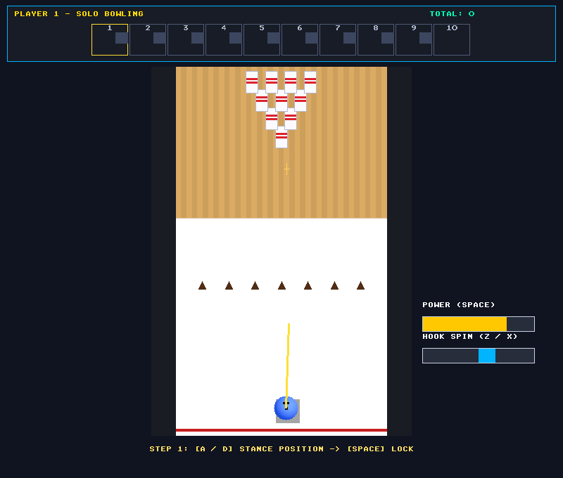

- **Objective**: Roll the bowling ball down the polished wood lane, knock down all 10 pins in each frame, string together Strikes and Spares, and bowl a Perfect 300 game!
- **Controls**:
  - `A` / `D` or `Left` / `Right`: Position ball stance along the approach line (Step 1).
  - `Space`: Lock ball position $\to$ Lock oscillating launch angle (Step 2) $\to$ Lock power and roll ball (Step 3).
  - `Z` / `X`: Apply lateral left / right hook spin (imparts curve as the ball approaches the pin pocket).
  - `1-3`: Game mode (**1: Solo Play**, **2: 2P Local Versus**, **3: vs CPU Bowler**).
  - `Tab`: Cycle CPU AI difficulty (Novice, Pro, Hall of Fame).
  - `M`: Toggle procedural audio.
  - `R`: Restart game.
- **Rules & Mechanics**:
  - **10-Frame Engine**: Standard frames 1-9 have up to 2 rolls. 10th frame awards a 3rd bonus ball on a Strike or Spare!
  - **Pin Physics**: Real-time pin-to-pin chain reaction physics, wobbling, pin sweeps, and gutter drops.
  - **Scoring**: Strikes score 10 + next 2 rolls; Spares score 10 + next 1 roll. Maximum possible score is **300**.
- **Pro Tip**: Stand slightly to the right of the center dot and add left hook spin (`Z`) to hit the 1-3 pocket at an angle for consistent explosive strikes!

---

### 65. Darts Masters (`darts/`)
*Tournament Darts Championship (501 / 301 / Cricket / Around the Clock)*

```bash
v run darts
```
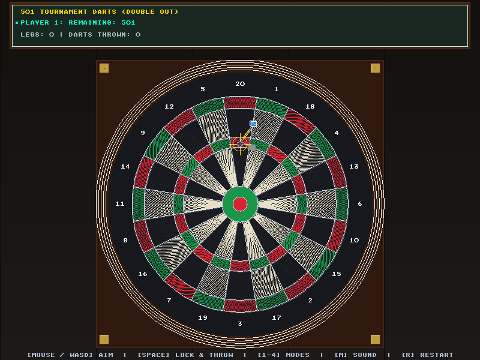

- **Objective**: Throw 3 darts per turn at the authentic 20-segment board, aim for high-scoring triples, and double-out to 0 without going bust!
- **Controls**:
  - `Mouse Move` or `WASD` / `Arrow Keys`: Aim targeting reticle on dartboard.
  - `Space` or `Left Click`: Lock aim target $\to$ Stop timing meter in green sweet spot to throw dart.
  - `1-4`: Game mode (**1: 501 Darts**, **2: 301 Darts**, **3: Cricket**, **4: Around the Clock**).
  - `P`: 2P Local Versus mode.
  - `C`: vs CPU AI Darts Opponent.
  - `Tab`: Cycle AI skill level (Casual, League Player, World Champion).
  - `M`: Toggle audio.
  - `R`: Reset leg.
- **Game Modes**:
  - **501 / 301**: Double-Out countdown. Displays live checkout routes (e.g. `T20 -> T20 -> D20` for 160). Score of 1 or below 0 triggers a **Bust**!
  - **Cricket**: Close numbers 15-20 and Bullseye with 3 hits each to score points.
  - **Around the Clock**: Hit numbers 1 through 20 in sequential order.
- **Pro Tip**: Master the timing meter release to hit the narrow Triple 20 bed (60 pts) consistently and build up a legendary **180** turn!

---

### 66. Billiards Pro (`pool/`)
*8-Ball & 9-Ball Pool with 2D Physics, Spin English & Ghost-Ball Aim*

```bash
v run pool
```
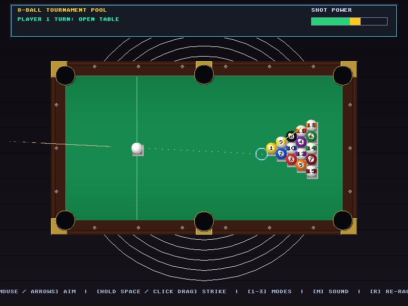

- **Objective**: Use your cue stick to pocket all of your assigned group balls (Solids 1-7 or Stripes 9-15) and legally pocket the black 8-ball to win the game!
- **Controls**:
  - `Mouse Move` or `Left` / `Right` / `A` / `D`: Rotate cue stick aiming angle.
  - `Left Click + Drag Down` or `Hold Space`: Pull back cue stick to set shot power, release to strike cue ball!
  - `1-3`: Game mode (**1: 8-Ball**, **2: 9-Ball**, **3: Practice / Trick Shot**).
  - `P`: 2P Local Versus mode.
  - `C`: vs CPU AI Hustler.
  - `Tab`: Cycle AI difficulty.
  - `M`: Toggle audio.
  - `R`: Re-rack balls.
  - `Click on Table (when Ball-in-Hand)`: Place cue ball anywhere on felt after opponent scratch.
- **Physics & Mechanics**:
  - Continuous elastic ball-ball collisions with momentum conservation ($e = 0.95$).
  - Ghost-ball projection guide shows exact impact location and object ball deflection line.
  - Cushion rail rebounds, pocket drop mouth jaws, and scratch penalties.
- **Pro Tip**: Use soft touch shots on balls near pockets to keep the cue ball in the center of the table for effortless follow-up position play!

---

### 67. Vegas Jackpot Slots (`slots/`)
*Authentic 777 Casino Slot Machine (3-Reel Classic & 5-Reel Cyber Multi-Line)*

```bash
v run slots
```
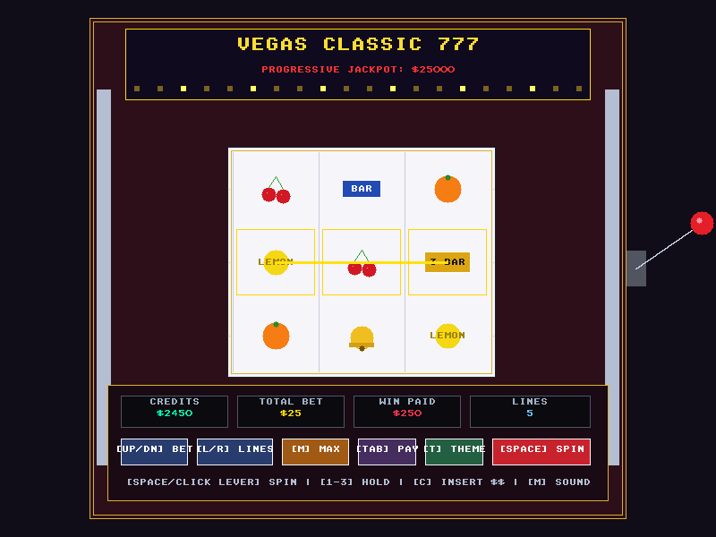

- **Objective**: Spin the mechanical reels, match classic fruit & casino symbols across active paylines, trigger Scatter Free Spins bonus rounds, and hit the Progressive Mega Jackpot!
- **Controls**:
  - `Space` or `Enter`: Pull mechanical arm lever / spin reels.
  - `Left Click on Lever` (Right side): Click and pull down lever handle to spin.
  - `Up` / `Down` or `W` / `S`: Adjust bet per payline ($1 to $500).
  - `Left` / `Right` or `A` / `D`: Adjust number of active paylines (1 to 20 lines).
  - `1`, `2`, `3`: Hold individual reels on 3-Reel Classic mode for the next spin.
  - `T`: Toggle machine theme (**Vegas Classic 777** $\leftrightarrow$ **Neon Cyber 5-Reel**).
  - `M`: Max Bet ($100 per line on all lines).
  - `C`: Insert cash (+ $500 Credits).
  - `Tab` or `P`: Open / Close full paytable & multiplier schedule.
  - `S`: Toggle procedural casino audio.
  - `Esc`: Close paytable / Exit game.
- **Paytables & Bonus Features**:
  - **Diamond ($$)**: Highest base payout (**1000x** on 5-reel, **500x** on 3-reel).
  - **Lucky 7 (7)**: Classic jackpot symbol (**500x** on 5-reel, **200x** on 3-reel).
  - **BARs**: Single, Double, Triple, and Any-3-BAR mix combinations.
  - **Wilds**: Substitutes for all symbols (except Scatter) to complete winning paylines (**1500x** for 5x Wild).
  - **Scatters & Free Spins**: 3+ Scatter stars trigger 10 to 25 Free Spins with a **3x Multiplier** on all wins!
  - **Progressive Jackpot**: 5% of every wager feeds the growing jackpot meter.
- **Pro Tip**: Use the Reel Hold feature (`1-3`) on 3-reel classic mode when two matching high-tier symbols (like Double 7s or Diamonds) appear on payline 1 to dramatically boost your odds of hitting the jackpot on the re-spin!

---

### 68. Uno Master (`uno/`)
*Classic 108-Card Uno with 4-Player AI Table & Uno Call Shouts*

```bash
v run uno
```
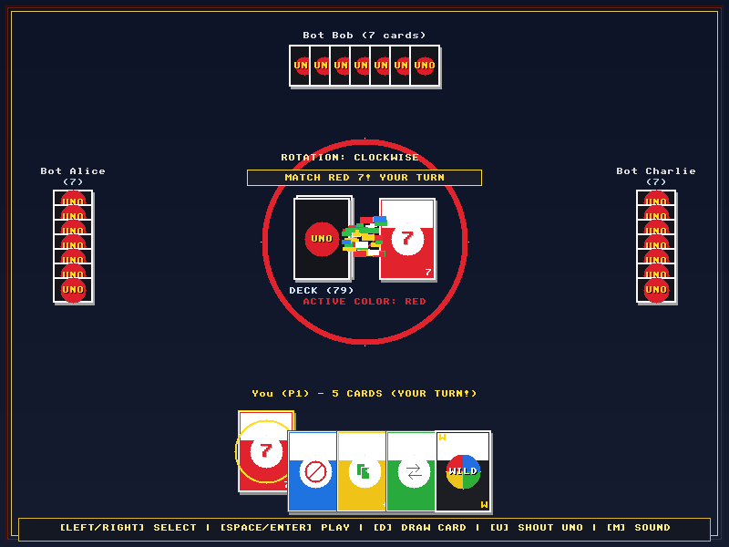

- **Objective**: Be the first player to empty your hand by matching the discard pile card by color, number, or action symbol!
- **Controls**:
  - `Left` / `Right` or `A` / `D`: Cycle through cards in your hand.
  - `Space` or `Enter`: Play selected card (or double-click with Mouse).
  - `X` or `Down`: Draw card from deck when no playable card exists.
  - `U` or Click **[CALL UNO]**: Shout "UNO!" when down to 1 or 2 cards.
  - `1`, `2`, `3`, `4` (or `R`, `B`, `G`, `Y`): Choose color when playing Wild / Wild Draw 4.
  - `M`: Toggle procedural audio.
  - `Esc`: Exit game.
- **Card Types & Rules**:
  - **Colors**: Red, Blue, Green, Yellow, and Wild.
  - **Skip**: Skips the next player's turn.
  - **Reverse**: Inverts table turn rotation direction (Clockwise $\leftrightarrow$ Counter-Clockwise).
  - **Draw Two (+2)**: Next player draws 2 cards and forfeits their turn.
  - **Wild**: Lets you declare any of the 4 active table colors.
  - **Wild Draw Four (+4)**: Next player draws 4 cards, forfeits turn, and color is declared!
  - **UNO Penalty**: If you play down to 1 card without calling UNO, you receive a **+2 Card Penalty**!
- **Pro Tip**: Save your Wild Draw 4 cards for late-round turns when opponents are down to 1 or 2 cards to disrupt their momentum!

---

### 69. War Card Battle (`war/`)
*The Definitive 52-Card War Showdown with Sudden-Death Duel Mechanics*

```bash
v run war
```
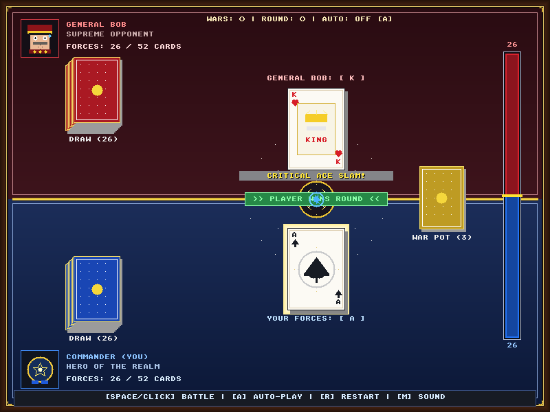

- **Objective**: Conquer all 52 cards in the deck by defeating the opponent general in head-to-head card ranks!
- **Controls**:
  - `Space` or `Left Click`: Flip card for next battle round.
  - `A`: Toggle **Auto-Play** mode for fast continuous automated warfare.
  - `R`: Restart match.
  - `M`: Toggle audio.
  - `Esc`: Exit game.
- **Rules & War Mechanics**:
  - **Standard Ranks**: 2, 3, 4, 5, 6, 7, 8, 9, 10, Jack, Queen, King, **Ace (Highest)**.
  - **Standard Round**: Both players flip the top card from their draw pile. The higher card captures both cards into the victor's win pile.
  - **"I DECLARE WAR!" (Ties)**: When both ranks match, War is declared! Both players place 3 cards face down into the War Loot Pot, then flip a 4th card face up in sudden death. The winner takes the entire pot!
  - **Double / Triple War**: If the war cards tie again, another war begins with additional face-down loot cards!
  - When a draw pile runs out, captured cards are shuffled and recycled into the draw pile.
- **Pro Tip**: Turn on Auto-Play (`A`) to watch intense, multi-round card wars resolve at high speed!

---

### 70. Blackjack 21 Pro (`blackjack/`)
*Authentic Vegas Casino Blackjack with Splits, Double Down, and Insurance*

```bash
v run blackjack
```
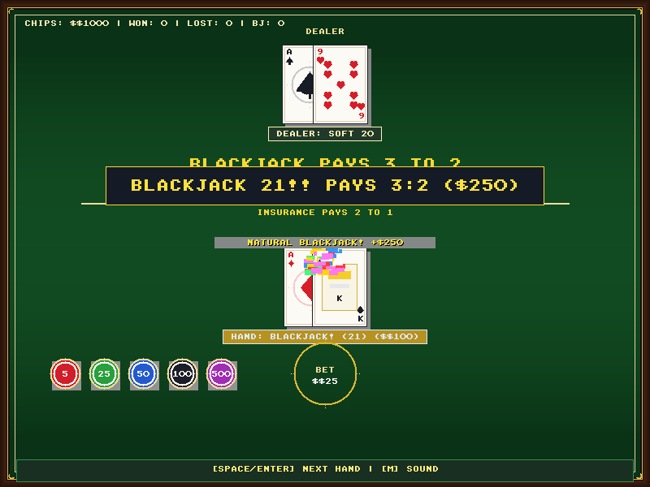

- **Objective**: Beat the dealer's hand total without exceeding 21!
- **Controls**:
  - `Space` or `Enter`: Deal hand / Next round.
  - `1`, `2`, `3`, `4`, `5`: Place chips (**$5**, **$25**, **$50**, **$100**, **$500**).
  - `C`: Clear current bet.
  - `H`: **Hit** (Draw another card).
  - `S`: **Stand** (End turn and keep current total).
  - `D`: **Double Down** (Double your wager, draw exactly 1 card, and stand).
  - `P`: **Split** (Split matching pair into two separate hands).
  - `I`: **Insurance** (Buy side bet against dealer Ace paying 2:1).
  - `M`: Toggle audio.
  - `Esc`: Exit game.
- **Vegas Table Rules**:
  - **Natural Blackjack**: 2-card 21 (Ace + 10/J/Q/K) pays **3:2** ($250 on a $100 bet).
  - **Dealer Rules**: Dealer hits on soft 16 or lower, stands on all 17s.
  - **Aces Value**: Automatically counted as 11 or 1 for optimal hand total.
- **Pro Tip**: Always Double Down on a total of 11 against a dealer 5 or 6 to maximize long-term positive expected value (+EV)!

---

### 71. Texas Hold'em Poker (`texas/`)
*4-Player No-Limit Texas Hold'em Poker with AI Personalities & 7-Card Evaluator*

```bash
v run texas
```
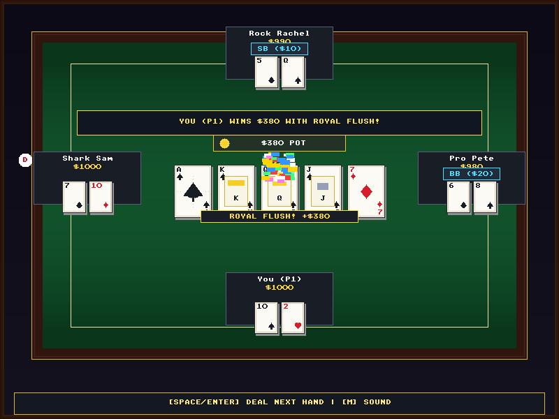

- **Objective**: Win chips by making the best 5-card poker hand or bluffing opponents into folding!
- **Controls**:
  - `C`, `Space`, or `Enter`: **Check** (if no bet to call) or **Call** current table bet.
  - `R`: **Raise** to selected amount.
  - `Up` / `Down` or `W` / `S`: Increase / decrease raise amount in increments of big blind.
  - `F`: **Fold** your hand.
  - `A`: **All-In** (Wager your entire chip stack!).
  - `M`: Toggle audio.
  - `Esc`: Exit game.
- **Streets & Betting Rounds**:
  - **Pre-Flop**: 2 hole cards dealt, Small Blind ($10) and Big Blind ($20) posted.
  - **Flop**: 3 community cards dealt face up.
  - **Turn**: 4th community card dealt.
  - **River**: 5th and final community card dealt.
  - **Showdown**: Active players reveal cards; best 5-card combination from 7 cards wins the pot!
- **Hand Rankings (Lowest to Highest)**:
  1. High Card
  2. One Pair
  3. Two Pair
  4. Three of a Kind
  5. Straight (5 consecutive cards)
  6. Flush (5 cards of same suit)
  7. Full House (3 of a kind + Pair)
  8. Four of a Kind (Quads)
  9. Straight Flush (5 consecutive cards of same suit)
  10. **Royal Flush** (A-K-Q-J-10 of same suit!)
- **Pro Tip**: Position is power in poker. When sitting on or near the Dealer Button (`D`), you act last on post-flop streets, giving you maximum information on opponents' moves!

---

## 🧪 Automated Unit Testing

You can run automated test suites for the game modules using the V test runner:

```bash
# Run tests across games
v test uno/
v test war/
v test blackjack/
v test texas/
v test slots/
v test bowling/
v test darts/
v test pool/
v test yahtzee/
v test etchasketch/
v test skifree/
v test jezzball/
v test simon/
v test memorymatch/
v test chimptest/
v test duke/
v test bubbleshooter/
v test flappy/
v test qbert/
v test puyopuyo/
v test goldminer/
v test minesweeper/
v test spaceinvaders/
v test sokoban/
v test game2048/
v test lightcycles/
v test pinball/
v test balloonfight/
v test sidescroller/
v test lolo/
v test racer/
v test ragdoll/
v test centipede/
v test rain/
v test cyberrunner/
```

---

## 📁 Repository Directory Structure

```
sdl_games/
├── airhockey/              # 1. Hyper Air Hockey
├── asteroids/              # 2. Asteroids Pro
├── balloonfight/           # 3. NES Balloon Fight
├── battleship/             # 4. Battleship Pro
├── bejeweled/              # 5. Bejeweled Match-3
├── blackjack/              # 70. Blackjack 21 Pro (Vegas Casino Table)
├── bomberman/              # 6. Bomberman Arcade
├── boulderdash/            # 7. Boulder Dash Retro
├── bowling/                # 64. Bowling Pro (10-Pin Bowling)
├── breakout/               # 8. Breakout Overdrive
├── bubbleshooter/          # 9. Bubble Shooter Pro
├── centipede/              # 10. Cyber Centipede Pro
├── chimptest/              # 11. Chimp Test Pro
├── chipschallenge/         # 12. Chip's Challenge Deluxe
├── clickarcade/            # 13. Click Arcade (4-in-1 Suite)
├── connect4/               # 14. Connect 4
├── cyberrunner/            # 15. Neon Vector Run 3D
├── darts/                  # 65. Darts Masters (501 / 301 / Cricket)
├── digdug/                 # 16. Dig Dug Classic
├── donkeykong/             # 17. Donkey Kong Arcade
├── dopewars/               # 18. Dope Wars 1990
├── duke/                   # 19. Duke Nukem: Cyber Outpost
├── etchasketch/            # 20. Etch A Sketch Deluxe
├── flappy/                 # 21. Flappy Bird Pro
├── frogger/                # 22. Frogger Arcade
├── galaga/                 # 23. Galaga Space Shooter
├── game2048/               # 24. 2048 Neon Pulse
├── gnujump/                # 25. GNUjump Tower
├── goldminer/              # 26. Gold Miner Classic
├── jezzball/               # 27. JezzBall Pro
├── lemmings/               # 28. Lemmings Master
├── liarsdice/              # 29. Liar's Dice Deluxe
├── lightcycles/            # 30. Tron Light Cycles
├── lolo/                   # 31. Adventures of Lolo
├── lunarlander/            # 32. Lunar Lander Simulator
├── mappy/                  # 33. Mappy Arcade
├── memorymatch/            # 34. Memory Match Pro
├── micromayhem/            # 35. Micro Mayhem
├── minesweeper/            # 36. Minesweeper Pro
├── missilecommand/         # 37. Missile Command Air Defense
├── pacman/                 # 38. Pac-Man Arcade
├── peggle/                 # 39. Peggle Extreme
├── picross/                # 40. Picross Pro
├── pinball/                # 41. NES Pinball
├── pong/                   # 42. Hyper Pong
├── pool/                   # 66. Billiards Pro (8-Ball & 9-Ball)
├── puyopuyo/               # 43. Puyo Puyo Cascade
├── qbert/                  # 44. Q*bert Isometric
├── racer/                  # 45. Cyber Drift Racer
├── ragdoll/                # 46. Ragdoll Physics Sandbox
├── rain/                   # 47. Monsoon Overdrive
├── reversi/                # 48. Reversi Master
├── rodentsrevenge/         # 49. Rodent's Revenge
├── scorchedearth/          # 50. Scorched Earth Deluxe
├── shinobi/                # 51. Cyber Shinobi Runner
├── columns/                 # 75. Sega Columns 1990 Gem Drop Classic
├── klax/                    # 76. Atari Klax 1989 Conveyor Matcher
├── puzzlefighter/           # 77. Super Puzzle Fighter II Turbo Arcade Gem Battler
├── zuma/                    # 78. Zuma: Temple of the Stone Idol Track Shooter
├── paneldepon/              # 79. Panel de Pon / Puzzle League Classic
├── samegame/                # 80. SameGame / Collapse Gem Cluster Shatter
├── blockdude/               # 72. TI-83 Block Dude Puzzle Platformer
├── fire/                    # 73. Nintendo Game & Watch: Fire 1980 LCD
├── screensaver/             # 74. Ultimate Retro Screensaver Suite (102 Templates)
├── sidescroller/           # 52. Cyberpunk Vanguard
├── simon/                  # 53. Cyber Simon
├── sinksub/                # 54. SinkSub Pro
├── skifree/                # 55. SkiFree Extreme
├── slots/                  # 67. Vegas Jackpot Slots (777 & Neon Cyber)
├── snake/                  # 56. Cyberpunk Snake
├── sokoban/                # 57. Sokoban Master
├── spaceinvaders/          # 58. Space Invaders Pro
├── tetris/                 # 59. Modern Tetris
├── texas/                  # 71. Texas Hold'em Poker Pro (No-Limit 4-Player)
├── towerdefense/           # 60. Cyber Tower Defense
├── trivia/                 # 61. Party Trivia Show
├── typing/                 # 62. CyberType: Neon Typist
├── uno/                    # 68. Uno Master (4-Player AI Table)
├── war/                    # 69. War Card Battle (52-Card Duel)
├── yahtzee/                # 63. Yahtzee Deluxe
└── screenshots/            # Visual gallery screenshots for all games
```

---

## 75. Sega Columns (`columns/`)
*1990 Sega Mega Drive & Arcade Match-3 Gem Drop Classic*

```bash
v run columns
```
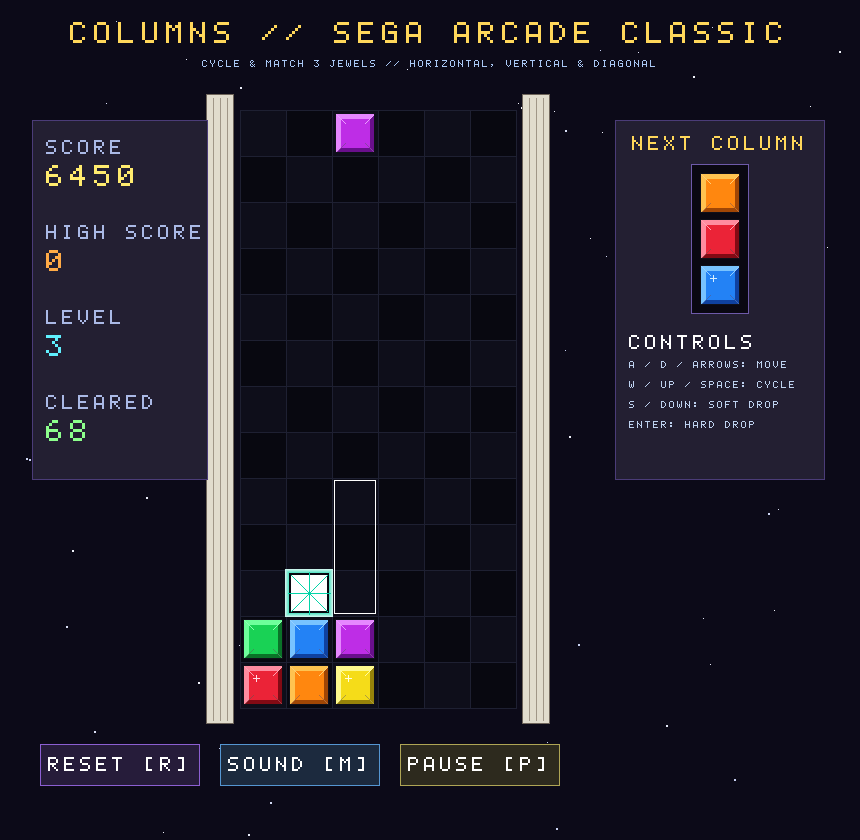

- **Goal**: Align falling columns of 3 jewels to match 3 or more jewels horizontally, vertically, or diagonally.
- **Controls**: `A`/`D` or `Left`/`Right` to move, `W`/`Up`/`Space` to cycle gems in flight, `S`/`Down` for soft drop, `Enter` for instant hard drop.

---

## 76. Atari Klax (`klax/`)
*1989 Atari Games 3D Conveyor Ramp Tile Matching Classic*

```bash
v run klax
```
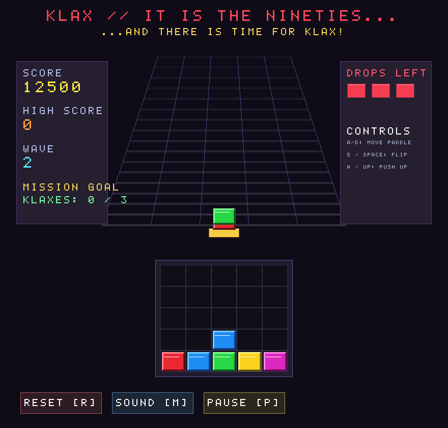

- **Goal**: Catch falling tumbling tiles off the 3D conveyor ramp onto your paddle and flip them into a 5x5 bin to form 3-in-a-row Klaxes.
- **Controls**: `A`/`D` to steer paddle, `S`/`Space` to flip top tile into the bin, `W`/`Up` to push the tile back up the conveyor ramp.

---

## 77. Super Puzzle Fighter II Turbo (`puzzlefighter/`)
*1996 Capcom 1v1 Split-Screen Arcade Gem Battler*

```bash
v run puzzlefighter
```
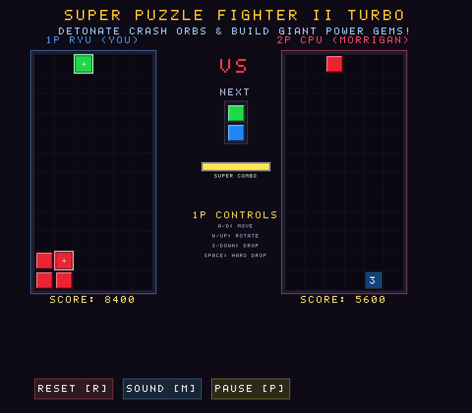

- **Goal**: Drop gem pairs, merge giant power blocks (2x2, 2x3, 3x3), and detonate connected clusters with glowing Crash Orbs to bury your opponent under counter garbage gems!
- **Controls**: `A`/`D` to move pair, `W`/`Up` to rotate clockwise, `S`/`Down` for soft drop, `Space` for hard drop.

---

## 78. Zuma: Temple of the Stone Idol (`zuma/`)
*2003 PopCap Aztec Temple Track Sphere Shooter*

```bash
v run zuma
```
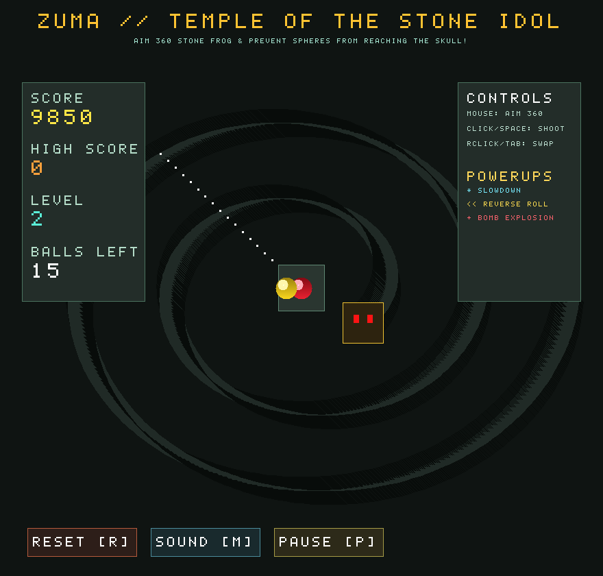

- **Goal**: Rotate the central Stone Frog 360 degrees to fire colored marbles into a continuous rolling train, creating 3+ matches and triggering magnetic gap-pull combos before the train reaches the golden skull!
- **Controls**: `Mouse Aim` 360 degrees, `Left Click` or `Space` to shoot marble, `Right Click` or `Tab` to swap current and next ball.

---

## 79. Panel de Pon / Puzzle League (`paneldepon/`)
*1995 Intelligent Systems / Nintendo Horizontal Swap Match-3*

```bash
v run paneldepon
```
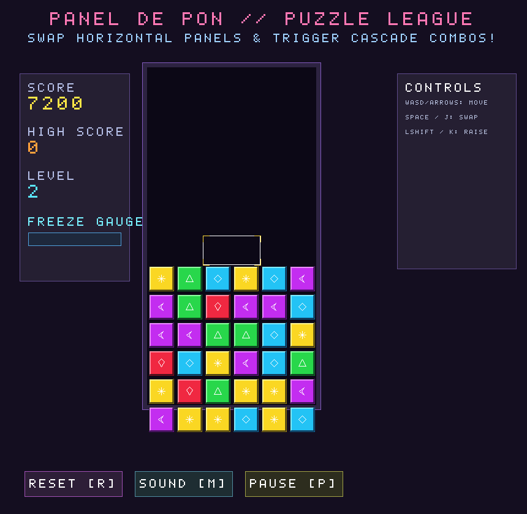

- **Goal**: Control a 2-panel horizontal cursor to swap adjacent colored glyph blocks, clear match-3+ lines horizontally and vertically, trigger cascading combos to freeze the rising stack!
- **Controls**: `WASD` or `Arrows` to move 2-tile cursor, `Space` or `J` to swap panels, `LShift` or `K` to manually raise stack.

---

## 80. SameGame / Collapse (`samegame/`)
*1985 / 1998 Gem Cluster Elimination Puzzle & Arcade Collapse*

```bash
v run samegame
```
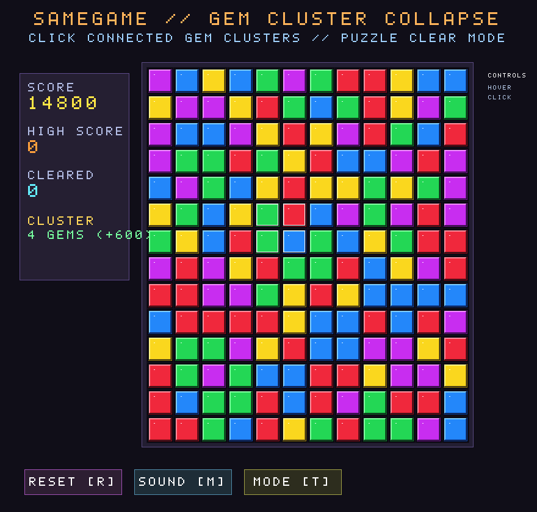

- **Goal**: Hover over connected clusters of 2 or more identical crystal gems and click to shatter them, causing upper gems to fall and empty columns to collapse leftward. Clear all gems for a massive +20,000 pt perfect clear bonus!
- **Controls**: `Mouse Hover` to select cluster, `Left Click` to shatter cluster, `T` to toggle between Classic Puzzle and Continuous Collapse Arcade mode.

---

## 81. Mario Bros. Arcade (`mariobros/`)
*1983 Nintendo Sewer Pipe Platformer & Simultaneous 2-Player Co-op*

```bash
v run mariobros
```
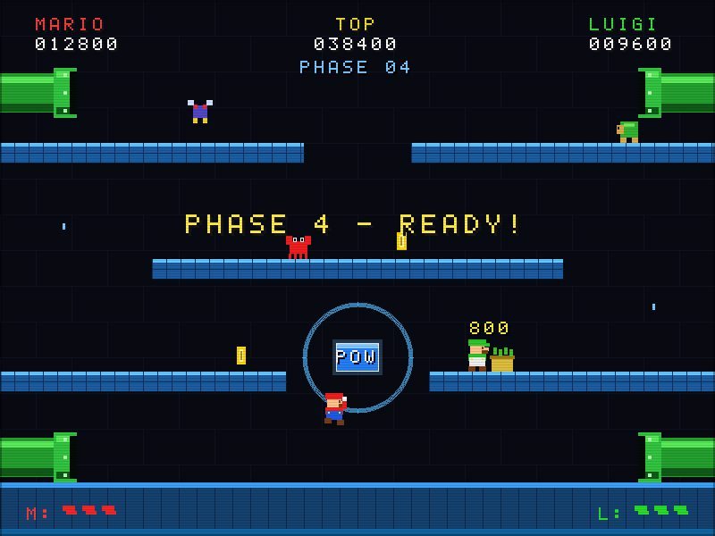

- **Goal**: Clear the sewer pipes of encroaching pests by bumping the platforms underneath them to flip them onto their backs, then kicking them into the water before they recover!
- **Pests & Enemies**:
  - **Shellcreeper (Turtle)**: Requires 1 bump underneath to flip onto its back; righting itself makes it move faster.
  - **Sidestepper (Crab)**: 1st hit angers it (turns fiery red, moves faster); 2nd hit flips it over.
  - **Fighter Fly (Fly)**: Hops along ledges; can only be flipped if bumped while its feet touch the floor.
  - **Slipice (Ice Chunk)**: Slides across platforms trying to freeze them into slippery ice. Bump to shatter into 500 bonus points.
  - **Fireballs (Green & Red)**: Floating bouncy fireballs that appear if a phase takes too long.
- **POW Block**: Centered in the lower tier, hitting the POW block from below shakes the entire screen and flips all grounded enemies simultaneously across all platforms (usable 3 times).
- **Bonus Rounds**: Timed coin rush stages with 10 golden coins to collect for a +5,000 pt perfect bonus!
- **Controls**:
  - **Player 1 (Mario)**: `A` / `D` or `Left` / `Right` to move, `Space` or `W` to jump.
  - **Player 2 (Luigi)**: `J` / `L` to move, `I` or `Up` to jump.
  - **Mode Selection**: `1` for 1-Player, `2` for 2-Player simultaneous co-op/versus.
  - **System**: `P` to pause, `R` to restart, `M` to mute/unmute procedural audio, `ESC` to return to title.

---

## 82. The Legend of Kage (`legendofkage/`)
*1985 Taito Acrobatic Ninja Classic & Feudal Japan Rescue Adventure*

```bash
v run legendofkage
```
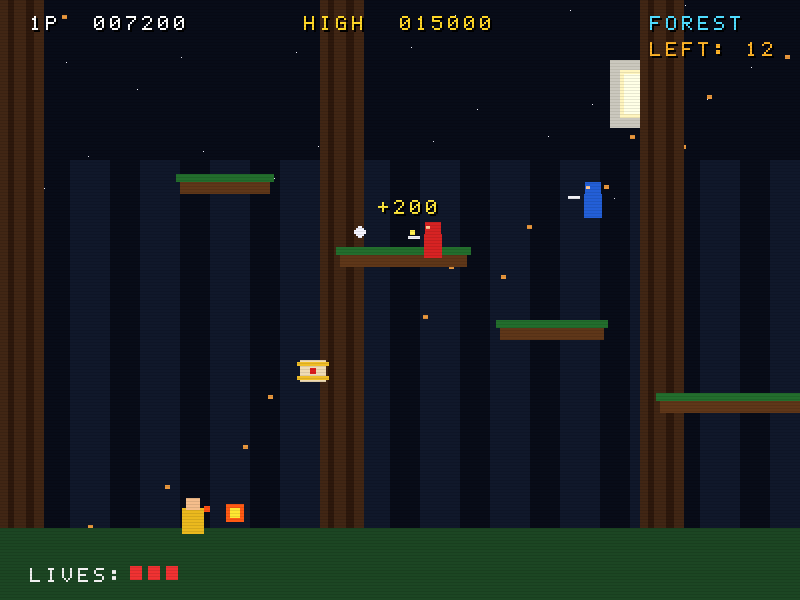

- **Goal**: Rescue Princess Kiri from warlord forces by leaping into ancient cedar tree canopies, scaling fortress battlements, parrying enemy shurikens in mid-air, and collecting Ninjutsu scrolls!
- **Ninjutsu Magic Scrolls**:
  - **Lightning (Raiko)**: Flashes the entire screen with thunder and electrocutes all on-screen enemies.
  - **Shadow Clones (Bunshin)**: Spawns dual ninja afterimages that mirror your movement and unleash triple shurikens!
  - **Fire Shield (Katon)**: Encircles Kage with orbiting fireballs that vaporize approaching enemies.
  - **Hayate Speed Boost (Golden Garb)**: Grants blazing running speed and maximum leap altitude.
- **Controls**:
  - `A` / `D` or `Left` / `Right`: Move and aerial directional control
  - `Space` or `W` / `Up`: Super Ninja High Leap (leap into tall trees and perch on branches)
  - `J` or `Z`: Katana Slash (slices enemies and parries/deflects incoming shurikens & fireballs!)
  - `K` or `X`: 8-Way Shuriken Throw
  - `P` to pause, `M` to mute audio, `C` to toggle CRT scanlines, `R` to restart, `ESC` for title.

---

## 83. Yie Ar Kung-Fu (`yiearkungfu/`)
*1985 Konami 1-on-1 Arcade & NES Fighting Pioneer*

```bash
v run yiearkungfu
```
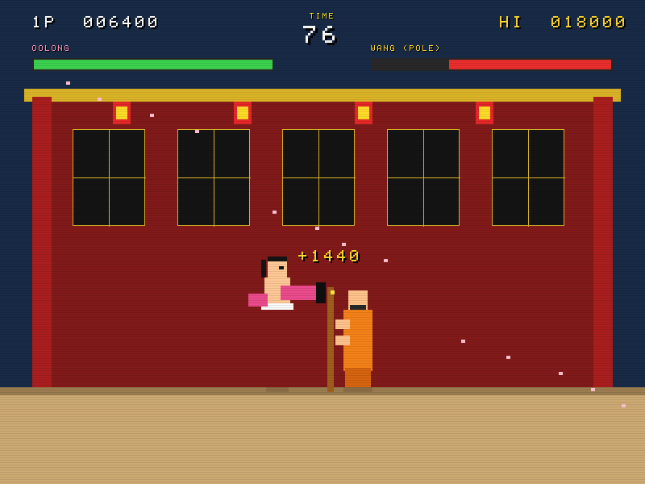

- **Goal**: Take control of martial artist Oolong and defeat the 5 legendary Weapon Masters in the Dojo Temple to claim the title of Grand Master!
- **The 5 Weapon Masters**:
  - **Wang**: Bo Staff Master — attacks with long-range thrusts and low sweeps.
  - **Tao**: Fireball Master — launches deadly fire breath projectiles.
  - **Chen**: Chain Whip Master — strikes with a heavy metallic flail chain.
  - **Lang**: Shuriken Fan Master — throws rapid steel stars with evasive backflips.
  - **Mu**: Flying Somersault Master — executes aerial dive-bombs and flight kicks.
- **16-Move Combat System**:
  - `A` / `D` or `Left` / `Right`: Walk forward / backward
  - `W` or `Up`: Jump straight or diagonal (combine with attacks for aerial kicks!)
  - `S` or `Down`: Crouch and duck under high projectiles
  - `J` or `Z`: Punch (High Punch with Up, Mid Punch, Low Punch with Down)
  - `K` or `X`: Kick (High Kick with Up, Mid Kick, Crouch Sweep with Down, Flying Kick in mid-air)
  - **Deflection**: Time your punches and kicks to knock away incoming shurikens, fireballs, and staff strikes!
  - `P` to pause, `M` to mute audio, `C` to toggle CRT scanlines, `R` to restart, `ESC` for title.

---

## 84. Kung-Fu Master (Spartan X) (`kungfu/`)
*1984 Irem / Nintendo Side-Scrolling Beat 'Em Up Legend*

```bash
v run kungfu
```
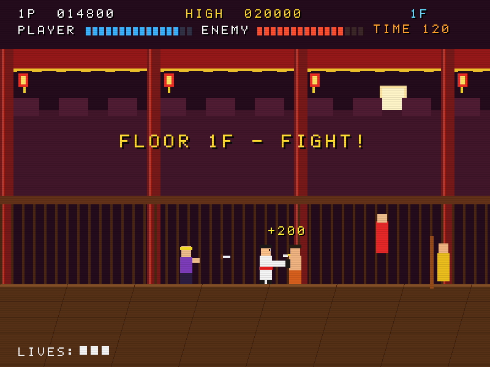

- **Goal**: Fight through all 5 floors of the Devil's Pagoda to rescue Sylvia from crime boss Mr. X!
- **The 5 Pagoda Floors & Bosses**:
  - **Floor 1**: Stick Fighter (*Wang*) — wields a long-reaching wooden staff.
  - **Floor 2**: Boomerang Fighter (*Tao*) — throws returning boomerangs at high and low trajectories.
  - **Floor 3**: Giant Bruiser (*Chen*) — towering brawler with devastating heavy punches.
  - **Floor 4**: Black Magician (*Lang*) — casts illusions, snakes, and fire apparitions.
  - **Floor 5**: Gang Leader (*Mr. X*) — master martial artist with lightning-fast counter-attacks.
- **Enemies & Hazards**:
  - **Grippers**: Puddle upon you to drain your vitality. Wiggle `Left`/`Right` rapidly to shake them off!
  - **Knife Throwers**: Hurl knives high and low. Duck or jump to dodge, or punch/kick the knives in mid-air!
  - **Tom Toms & Falling Pots**: Acrobatic dwarfs and descending clay jars releasing snakes and fire-dragons.
- **Controls**:
  - `A` / `D` or `Left` / `Right`: Walk forward / backward
  - `W` or `Up` / `Space`: Jump (combine with J/K for Jump Kick / Jump Punch)
  - `S` or `Down`: Crouch (combine with J/K for Low Sweep / Low Punch)
  - `J` or `Z`: Punch (200 pts)
  - `K` or `X`: Kick (100 pts)
  - `Left` / `Right` rapid alternating: Wiggle-escape from grabbing Grippers!
  - `P` to pause, `M` to mute audio, `C` to toggle CRT scanlines, `R` to restart, `ESC` for title.

---

## 85. Dr. Mario (`drmario/`)
*1990 Nintendo Classic Falling-Block Action Puzzle*

```bash
v run drmario
```
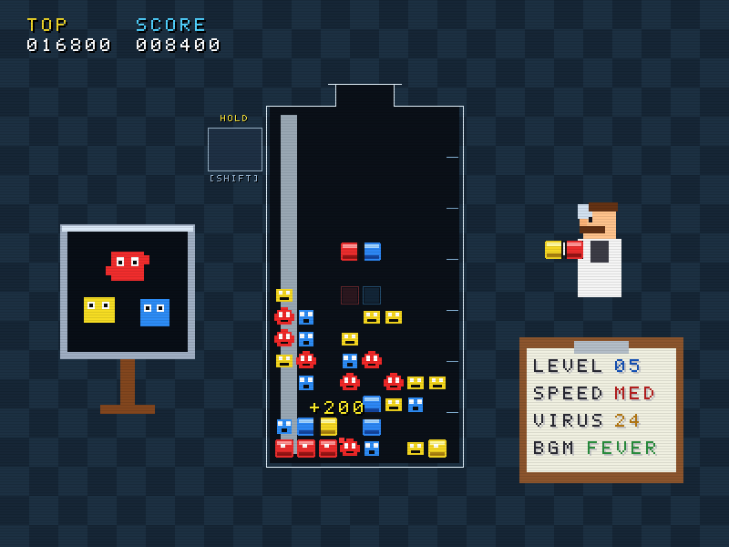

- **Goal**: Clear the 8x16 medicine bottle playing field by tossing 2-colored Megavitamin capsules to connect 4 or more matching color segments (Red, Yellow, Blue) in horizontal or vertical lines to eradicate all viruses!
- **Core Mechanics**:
  - **Viruses**: Red (Fever), Yellow (Chill), and Blue (Weird) viruses populate the bottle based on Level (0 to 20).
  - **Megavitamin Capsules**: 2-colored pills that rotate clockwise/counter-clockwise with authentic wall kicks.
  - **Cascading Gravity Physics**: When lines clear and pills split, unsupported pill halves drop into lower openings, triggering massive chain-reaction combo multipliers!
  - **Microscope Petri Dish**: Animated giant dancing viruses on the left that disappear as their corresponding viruses are completely eradicated from the bottle.
- **Modern Quality-of-Life Enhancements**:
  - **Ghost Projection Shadow**: Translucent projection showing exact capsule landing position (Toggle with `G`).
  - **Instant Hard Drop**: Slam capsules directly to the bottom with impact particles & bonus points (`Space` / `Enter`).
  - **Capsule Hold / Stash Queue**: Stash an upcoming capsule or swap with current capsule (`LShift` / `RShift` / `H`).
  - **Dual Iconic Soundtracks**: Authentic procedural **Fever** (funk groove) and **Chill** (smooth latin jazz) synthesizers (Cycle with `T` or `B`).
  - **Title Screen Level Select**: Start on any level from `00` to `20` with `Left` / `Right` arrow keys.
- **Controls**:
  - `A` / `D` or `Left` / `Right`: Move capsule horizontally
  - `S` or `Down`: Soft drop (accelerate descent)
  - `Space` / `Enter`: Instant Hard Drop
  - `W` / `Up` / `J` / `Z`: Rotate capsule Clockwise
  - `K` or `X`: Rotate capsule Counter-Clockwise
  - `LShift` / `RShift` / `H`: Hold capsule queue (stash / swap)
  - `G`: Toggle Ghost landing projection
  - `T` / `B`: Cycle soundtrack (FEVER / CHILL / OFF)
  - `1` / `2` / `3`: Change drop speed (LOW, MED, HI)
  - `P` to pause, `M` to mute audio, `C` to toggle CRT scanlines, `R` to restart, `ESC` for title.

---

## 86. Yoshi's Cookie (`yoshicookie/`)
*1992 Nintendo / BPS Classic Line-Sliding Bakery Puzzle*

```bash
v run yoshicookie
```
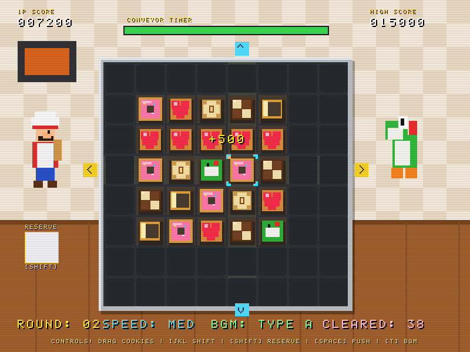

- **Goal**: Clear the 8x8 baking tray by shifting complete rows and columns so that an entire horizontal row or vertical column is filled with the exact same cookie type!
- **Cookie Varieties**:
  - 🍩 **Donut**: Golden glazed ring with strawberry icing and rainbow sprinkles.
  - ❤️ **Heart**: Frosted pink strawberry sugar cookie.
  - 💎 **Diamond**: Crisp almond wafer with waffle hash marks.
  - 🔲 **Checkered**: Two-tone chocolate and vanilla butter square.
  - 🌙 **Crescent**: Golden flaky vanilla croissant.
  - ⭐️ **Yoshi Star**: Green dino star wildcard cookie.
- **Core Mechanics**:
  - **Wrap-Around Tile Sliding**: Grabbing a row or column and moving shifts all cookies across with seamless wrap-around physics.
  - **Line Matching**: Full matching rows or columns shatter into delicious crumb bursts and clear from the tray.
  - **Compacting & Combos**: Remaining cookies settle inward toward the center. Cascading matches yield compounding score multipliers!
  - **Conveyor Timer Threat**: A kitchen timer gauge counts down. When empty, a new row or column of cookies enters from the top or right. If cookies overflow past the 8x8 baking pan border, it's Game Over!
- **Modern Quality-of-Life Enhancements**:
  - **Reserve Cookie Plate**: Stash a cookie or swap with the porcelain reserve dish on the countertop (`LShift` / `RShift` / `H` or direct mouse click).
  - **Direct Shift Keys**: Instant `I` / `J` / `K` / `L` shift keys without needing to hold a grab button.
  - **Mouse Drag & Perimeter Arrow Buttons**: Click and drag cookies directly, or click the perimeter directional buttons ($\blacktriangleleft \blacktriangleright \blacktriangle \blacktriangledown$).
  - **Instant Conveyor Rush**: Manual conveyor push (`Space` / `Enter`) granting +50 bonus points.
  - **Dual Iconic Soundtracks**: Authentic procedural **Type A (Bakery Ragtime)** and **Type B (Fast Bouncy Swing)** synthesizer tracks (Cycle with `T` or `B`).
  - **Title Screen Round Selector**: Choose starting round from `01` to `10` with `Left` / `Right` arrows.
- **Controls**:
  - **Mouse**: Click & Drag cookies, or click perimeter arrow buttons ($\blacktriangleleft \blacktriangleright \blacktriangle \blacktriangledown$), or click the Reserve Plate.
  - **Direct Shift**: `I` / `J` / `K` / `L` to shift row or column instantly.
  - **Classic Movement**: `W` / `A` / `S` / `D` or `Arrow Keys` to move cursor.
  - **Shift with Grab**: Hold `Z` + `WASD` / `Arrows` to shift row or column.
  - **Reserve Plate**: `LShift` / `RShift` / `H` to stash or swap active cookie.
  - **Conveyor Fast Push**: `Space` / `Enter` for instant manual push (+50 pts).
  - **Soundtrack**: `T` / `B` to cycle music (Type A / Type B / Off).
  - `1` / `2` / `3`: Set conveyor speed (LOW, MED, HI)
  - `P` to pause, `M` to mute audio, `C` to toggle CRT scanlines, `R` to restart, `ESC` for title.

---

## 📜 License & Credits

Built with ❤️ in [V](https://vlang.io/) using [SDL2](https://www.libsdl.org/) and [vlang/sdl](https://github.com/vlang/sdl).
All game logic, physics engines, procedural sound synthesizers, and vector graphics are custom-built for high performance and zero external binary dependencies.


